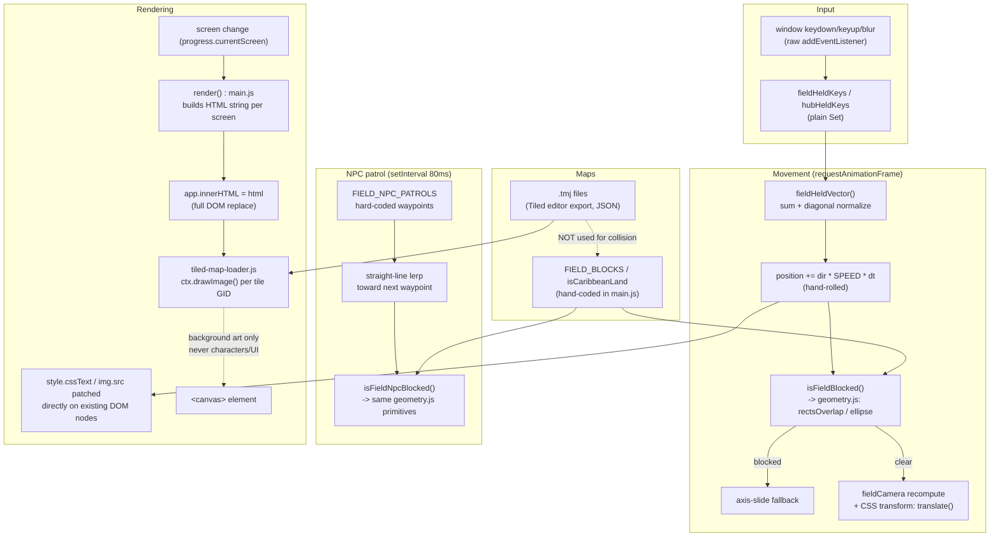

# Current Game Engine Audit

**Status:** factual audit, read-only. No packages were installed and no code was changed to produce this report. Verified against the repository as of 2026-07-23.

## Summary

**No game engine, rendering library, physics engine, animation library, input library, or pathfinding library is installed anywhere in this repository — not as a direct dependency, and not transitively.** The game (`apps/web/src/main.js`, ~8,000 lines) renders entirely through hand-written DOM/CSS (template-literal HTML strings assigned to `innerHTML`), with one narrow exception: a hand-rolled Canvas2D compositor (`apps/web/src/engine/tiled-map-loader.js`) that paints **background tile-map art only** — never characters, NPCs, HUD, or dialogue. Movement, camera, collision, sprite animation, and NPC patrol logic are all hand-rolled arithmetic directly in `main.js` and a small `engine/` utilities folder. Tiled (the desktop map editor) is used purely as an authoring tool; its `.tmj` JSON export is manually parsed, and even then only for visuals — collision/walkable-area data is independently hand-coded and kept in sync by convention, not derived from the Tiled file.

---

## 1–10: Answers

### 1. What framework or engine currently renders the game?

None. There is no game engine. `apps/web/src/main.js` is loaded as a plain ES module from `apps/web/index.html` (`<script type="module" src="/src/main.js">`) into a single `<div id="app">` mount point — no React, Vue, Svelte, or any UI framework bootstrap exists (confirmed by repo-wide grep for `ReactDOM`, `createRoot`, `Vue.`, `createApp`, `from "react"`, `from "vue"`: zero matches). The central `render()` function (`apps/web/src/main.js:5871`) switches on `progress.currentScreen`, builds one large HTML string from screen-builder functions, and replaces the DOM with `app.innerHTML = html` (`main.js:6022`).

### 2. Is the game using Canvas, CSS/DOM positioning, WebGL, React, or another renderer?

**Primarily CSS/DOM positioning**, with a narrow, deliberate exception:

- **Screens, HUD, dialogue, menus**: DOM elements built from template-literal HTML strings, swapped in via `innerHTML` on screen change, then patched in place (`style.cssText`, `dataset`, `classList`, `.src`) on every subsequent movement/animation tick without re-running `innerHTML`.
- **Map background art**: a small number of `<canvas>` elements (e.g. `id="riverbendTiledCanvas"`) exist specifically for Tiled tile-layer art, drawn via `CanvasRenderingContext2D.drawImage()` in `apps/web/src/engine/tiled-map-loader.js`. This is scenery only — the player, NPCs, and all UI are separate DOM elements layered visually on top of/around the canvas, not drawn into it.
- No WebGL, no SVG-based gameplay rendering (an SVG is used only for the static Navigation Table map projection, `apps/web/src/engine/geo-projection.js`), no React/Vue/other framework.

### 3. Which library controls character movement?

None — it's hand-written. Player position is tracked in tile-grid float coordinates (`fieldMovement = { x, y, facing, moving, step, queued }` at `main.js:531`; `instituteMovement` at `main.js:1286`). A self-terminating `requestAnimationFrame` loop (`runFieldMovementLoop`, `main.js:5232-5275`, and its hub equivalent `runHubMovementLoop`) reads held keys each frame, sums them into a direction vector, normalizes diagonals (`Math.SQRT1_2`), and integrates position by hand: `position += direction * FIELD_SPEED * (elapsed / 1000)`, with `FIELD_SPEED = 3.65` tiles/second (`main.js:534`). On collision it axis-slides (tries the full diagonal move, then X-only, then Y-only). No velocity/physics library, no easing/tweening library.

### 4. How are keyboard inputs handled?

Raw browser events, no library. `window.addEventListener("keydown", handleWindowKeydown)` / `"keyup"` / `"blur"` are registered once at startup (`main.js:7994-7996`). Held keys are tracked in plain JavaScript `Set`s — `fieldHeldKeys`, `hubHeldKeys`, `stormHeldKeys` (a mini-game) — added on `keydown`, removed on `keyup`, and all cleared on window `blur` to prevent "stuck key" movement. A single shared key map handles WASD + arrow keys:

```js
const FIELD_MOVE_KEYS = {
  arrowup: [0, -1], w: [0, -1],
  arrowdown: [0, 1], s: [0, 1],
  arrowleft: [-1, 0], a: [-1, 0],
  arrowright: [1, 0], d: [1, 0],
};   // main.js:536-544
```

### 5. How are sprite animations handled?

Two techniques, neither a library:

- **Player/NPC characters**: whole separate PNG files per direction × idle/step state (e.g. `chronicler-a-down-idle.png`, `chronicler-a-down-step.png`, under `apps/web/src/assets/chronicle-sprites/field/`), swapped by assigning a new value to `.src` every tick (`main.js:5125-5132`). The walk-cycle "animation" is a CSS `@keyframes` positional bob (player) or an opacity crossfade between two stacked `` elements (NPCs) — not spritesheet frame-slicing.
- **Map tile art**: true GID-based spritesheet slicing — `tiled-map-loader.js` computes a source rectangle per tile from Tiled's tileset data and calls `ctx.drawImage(image, sx, sy, tw, th, dx, dy, tw, th)`, including support for Tiled's per-tile animation frames, re-rendering via `requestAnimationFrame` only when a tileset has animated tiles.

### 6. How are collision boundaries defined?

Hand-rolled AABB rectangle-overlap and point-in-ellipse math, no physics/collision library. `apps/web/src/engine/geometry.js` (18 lines) exports three pure functions:

```js
export function ellipse(x, y, cx, cy, rx, ry) {
  return ((x - cx) / rx) ** 2 + ((y - cy) / ry) ** 2 <= 1;
}
export function rectsOverlap(a, b) {
  return a.x1 < b.x2 && a.x2 > b.x1 && a.y1 < b.y2 && a.y2 > b.y1;
}
export function footBoxFor(x, y) {
  const footY = y + 0.58;
  return { x1: x - 0.34, x2: x + 0.34, y1: footY - 0.18, y2: footY + 0.2 };
}
```

Each unit has a hand-measured array of blocking rectangles (`FIELD_BLOCKS`, `UNIT2_FIELD_BLOCKS`, `UNIT3_FIELD_BLOCKS`, `HUB_BLOCK_RECTS`, `ARCHIVE_ROOM_BLOCK_RECTS`) and a hand-tuned "land mask" function unioning several ellipses (`isCaribbeanLand`, `main.js:5134-5140`) or a simple rectangle bound (`isRiverbendLand`, `isCommonCauseLand`). `isFieldBlocked()` (`main.js:5156-5170`) samples the player's foot-box corners against the land mask and against every block rect and NPC foot-box via `rectsOverlap()`.

### 7. Are maps created in code, JSON, Tiled, images, or another format?

**Tiled JSON (`.tmj`), used only as an authoring/export format — no Tiled runtime library.** Six `.tmj` files live in `apps/web/src/content/maps/` (`riverbend-field.tmj`, `caribbean-field.tmj`, `archive-room.tmj`, `hallway.tmj`, `common-cause-field.tmj`, and `sandy-island-demo.tmj`, which is an unshipped preview fixture only referenced by a standalone `tiled-preview.html`, not `main.js`). These are imported as raw JSON (`import ... from "./content/maps/riverbend-field.tmj?raw"`), `JSON.parse`d, and rendered by the bespoke `tiled-map-loader.js` compositor described above. Tiled the desktop app is a level-*design* tool here, nothing more — its own file header states it is "Scoped to orthogonal orientation, uncompressed tile-layer data, no flip/rotate flags," i.e. a narrow, hand-written parser, not a general Tiled runtime.

Critically, **collision/walkable-area data is never read from the `.tmj` files** — it's independently hand-coded in `main.js` (see Q6), and a code comment at `main.js:969-971` confirms the Tiled-art generator scripts are manually kept in sync with the hand-coded collision data, not the reverse. Some maps (e.g. the Institute hub, Archive Room targets) are entirely hand-coded coordinate/rectangle arrays with no Tiled art at all.

### 8. How is NPC movement currently implemented?

Scripted waypoint patrol, no pathfinding. Each NPC has a hard-coded array of patrol points (`FIELD_NPC_PATROLS`, e.g. `main.js:625-637`). A `setInterval(updateFieldNpcs, 80)` loop (`main.js:799`) advances each NPC in a straight line toward its next waypoint (`dx/dy` normalized via `Math.hypot`), with per-NPC speed/timing offsets (seeded from array index) so NPCs don't move in lockstep. Collision reuses the exact same `rectsOverlap`/land-mask primitives the player uses (`isFieldNpcBlocked`, `main.js:717-732`). If a step would collide, the NPC simply aborts that leg and advances to the next scripted point — there is no route-around-the-obstacle behavior, no graph search, no navmesh.

### 9. Which installed dependencies could support movement, animation, collision, pathfinding, or asset loading?

None, directly. The full dependency list is 11 packages total (see table below) — none are a movement, animation, collision, or pathfinding library. The closest thing to "asset loading" support is Vite itself (`import.meta.url` asset URLs, `?raw` imports, `import.meta.glob` for tileset resolution) — which is a build tool, not a game/asset-management library, and is already being used for exactly that purpose.

### 10. What is causing the game's current production size?

Not code. The existing `apps/web/dist/` build (from a prior build, not rebuilt for this audit) totals **~13 MB**: one JS bundle (1.16 MB), one CSS bundle (149 KB), and **~11 MB of image assets** across 12 files, dominated by a single 3.7 MB JPG (a source document scan) and several 0.6–1.1 MB PNGs (tile/sprite art). There is no engine dependency contributing JS weight — the entire 1.16 MB JS bundle is this repo's own `main.js` plus its content/repository/quest-type modules. Production size is an **asset-optimization** problem (uncompressed/unresized images), not an architecture or dependency-weight problem.

---

## Dependencies (exact versions)

Single `package.json` at repo root; no separate `apps/web/package.json` (Vite's `root: "apps/web"` in `vite.config.js` just points the build at that directory).

| Package | Version | Type | Game-engine-related? |
|---|---|---|---|
| `@anthropic-ai/sdk` | `^0.110.0` | dependency | No — AI grading backend |
| `@supabase/supabase-js` | `^2.58.0` | dependency | No — accounts/classroom backend |
| `vite` | `^7.0.0` | devDependency | No — build tool |
| `vitest` | `^4.1.10` | devDependency | No — test runner |
| `zod` | `^4.4.3` | devDependency | No — schema validation |
| `eslint` | `^10.6.0` | devDependency | No |
| `@eslint/js` | `^10.0.1` | devDependency | No |
| `eslint-config-prettier` | `^10.1.8` | devDependency | No |
| `prettier` | `^3.9.5` | devDependency | No |
| `jsdom` | `^29.1.1` | devDependency | No — test DOM shim |
| `playwright` | `^1.61.1` | devDependency | No — browser test automation, not game rendering |

A full-text grep of `package-lock.json` (npm, `lockfileVersion: 3`, the only lockfile present — no `pnpm-lock.yaml`/`yarn.lock`) for `phaser`, `pixi`, `three`, `matter-js`, `kontra`, `excalibur`, `tmx-parser`, `planck`, `box2d`, `pathfinding`, `easystarjs`, `gsap`, `anime.js`, and `hammer.js` returned **zero matches** — confirming none of these are present even as transitive/indirect dependencies of the packages above.

`vite.config.js` in full:

```js
import { defineConfig } from "vite";

export default defineConfig({
  root: "apps/web",
  server: { open: true },
});
```

No plugins, no framework adapter, no custom asset pipeline configuration.

---

## Architecture diagram



Key point the diagram makes explicit: **the Tiled `.tmj` pipeline and the collision/movement system are two independent, manually-synchronized systems**, not one engine reading one source of truth.

---

## Candidate libraries (informational — not a recommendation to install now)

These are noted only because the request asked which safe, open-source libraries would be compatible with the existing stack, in case any path below is chosen later. None are being recommended for immediate adoption:

- **Grid-based pathfinding** (e.g. `pathfinding` npm package — small, zero-dependency, A*/Dijkstra over a 2D grid): would slot cleanly under the existing NPC system since collision is already grid/rect-based, without requiring any renderer change. Relevant only if real NPC route-around-obstacle behavior is ever wanted — the current scripted-waypoint approach has no known bug/complaint driving this.
- **Image optimization tooling** (e.g. `vite-plugin-image-optimizer`, or simply pre-compressing/resizing the source PNGs/JPG in `apps/web/src/assets/`): directly addresses the ~11 MB of the ~13 MB production build (Q10) without touching any game logic.
- **A dedicated 2D engine** (Phaser is the obvious candidate given Tiled `.tmj` content already exists): this repo's own architecture docs (`docs/architecture/ARCHITECTURE-QUICKREF.md`, `docs/architecture/ARCHITECTURE-REVIEW-AND-SIMPLIFICATION.md`) already evaluated and explicitly deferred this — "Playwright, Phaser, Tiled, and inkjs are deferred — real candidates for later, not currently being adopted, no POC scheduled unless a task explicitly says otherwise." This audit's findings are consistent with that prior decision, not a reason to revisit it unprompted.

---

## Would adding a game engine be beneficial or disruptive? Improve in place, or migrate?

Per this repo's own binding scope document (`ARCHITECTURE-REVIEW-AND-SIMPLIFICATION.md`, which CLAUDE.md designates as authoritative over the longer-term proposal when the two disagree): the game currently works, has no automated test coverage over movement/collision/camera code, and the codebase's explicit stated policy is *not* to physically extract movement/collision/camera logic out of `main.js` "merely for architectural neatness," reserving that for if/when a proven engine adapter is actually replacing it — which is not currently scheduled. Combined with this audit's finding that production size is an asset problem, not an architecture problem, the facts here point toward improving in place over migrating, but this section is offered as a finding for the user's decision, not a decision already made.

---

## Three paths compared

| Axis | A: Minimal improvement in place | B: Add focused libraries | C: Migrate to a dedicated 2D engine |
|---|---|---|---|
| Implementation difficulty | Low | Low–Medium | High |
| Risk of breaking existing features | Low | Low–Medium (new dep surface, but scoped) | High |
| Movement quality | Same as today (already smooth, delta-time-scaled) | Same as today unless a specific gap is targeted | Highest ceiling (engine-native tweening/physics) |
| Collision quality | Same as today (AABB/ellipse, adequate for current maps) | Same, or improved if a collision helper is added | Highest ceiling (broad-phase/narrow-phase physics) |
| NPC pathfinding support | None (scripted waypoints only) | Can add real A* via a small grid-pathfinding lib | Highest ceiling (engine or plugin pathfinding) |
| Sprite animation support | Same as today (`` swap + CSS) | Could add spritesheet slicing without an engine | Highest ceiling (native animation/frame systems) |
| Map-editor support | Same as today (Tiled export, hand-parsed) | Same, or a fuller Tiled-JSON reader if gaps appear | Highest ceiling (native/plugin Tiled runtime, e.g. Phaser's Tilemap API) |
| Asset optimization | Directly addressable now (compress/resize images) — the actual driver of the 13 MB build | Same as Path A, optionally automated via a build plugin | Unrelated to engine choice; would still need doing |
| Long-term maintainability | Consistent with current documented policy; zero new dependency risk | Manageable if each addition is small, scoped, and justified by a real gap | Full rewrite of a ~8,000-line working game's rendering/movement/collision; highest long-term payoff *if* the game's scope grows to need it, but currently against documented policy |

### Path A — Minimal improvement in place

Keep the current hand-rolled DOM/CSS + Canvas2D architecture exactly as is, and address concrete pain points directly — e.g. compress/resize the ~11 MB of source images driving production bundle size, or polish specific sprite-animation/collision edge cases as they're reported. No new dependencies, no risk to the "preserve the working game" invariant already in CLAUDE.md. Lowest capability ceiling, but there is no evidence in this audit of a capability gap actually blocking current work — movement, collision, and animation all function as designed today.

### Path B — Add focused libraries without changing engines

Layer a small, targeted library on top of the existing renderer for a specific, real gap — most plausibly a grid pathfinding library if NPC routing ever needs to go beyond scripted waypoints, or an image-optimization build step for the asset-size issue found in Q10. Each addition is independently reversible and doesn't touch the render loop, camera, or `innerHTML`-based screen system. Risk is proportional to how many such libraries accumulate — one well-scoped addition is low risk; several compounding ad hoc libraries would start to resemble Path C's complexity without its benefits.

### Path C — Migrate to a dedicated 2D engine

Replace the hand-rolled renderer/movement/collision/NPC systems with a real engine (Phaser is the natural fit given `.tmj` content already exists and Phaser has native Tiled support). This offers the highest ceiling on every capability axis — real physics, real pathfinding, spritesheet-native animation, a maintained Tiled-JSON runtime instead of a bespoke 180-line one — but requires rewriting the rendering layer of an ~8,000-line file that currently works, with zero existing test coverage to catch regressions, directly against this repo's own explicit "don't extract movement/collision/camera out of main.js" policy and its "Phaser is deferred, no POC scheduled" stance. This is the highest-risk, highest-effort, highest-ceiling path, and the one this repo's own architecture documents have already chosen not to pursue at this stage.
