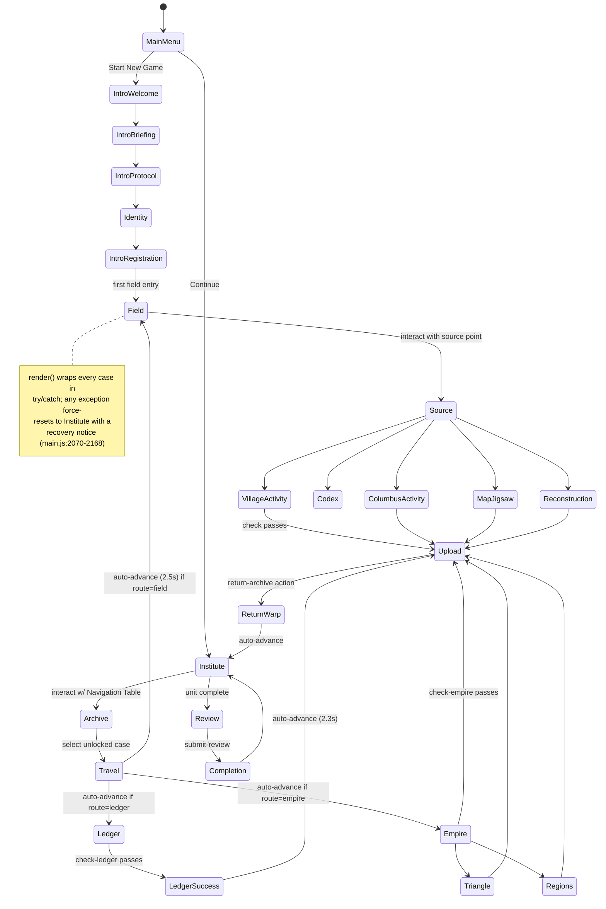
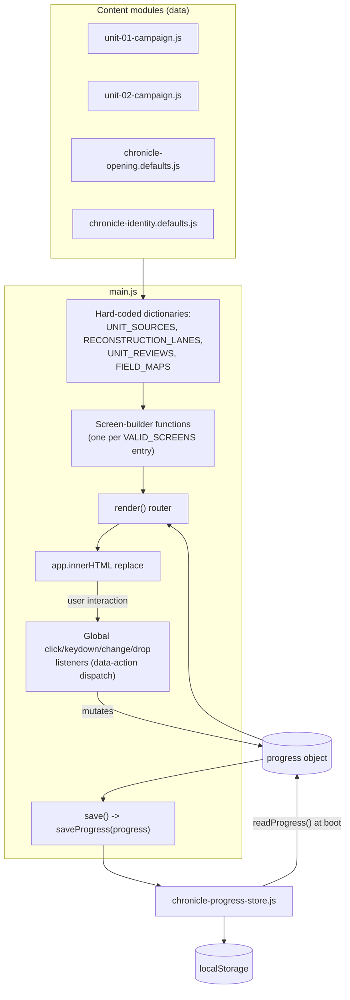

# Current Repository Audit — Chronicle

Status: current-state inspection only. No application code, configuration, or file layout was changed to produce this document. All findings are verified against the actual source on branch `platform-architecture-refactor` (checked out at commit `8aa0c56`), not against prior documentation claims.

## 1. Executive summary

Chronicle is a single-file, framework-free browser game: **`apps/web/src/main.js` is 2,927 lines** — roughly double the "~1,350 lines" figure in `CLAUDE.md` and the project's skill doc, which are stale. It owns screen routing, field/hub movement and collision, NPC patrol, dialogue, procedural Web Audio, several drag/drop and MCQ mini-games, an in-app "Author Mode," and all HTML rendering via template-literal strings — no React/Vue/Phaser/any framework is in use anywhere in the shipped app.

Several things exist that current documentation does not mention at all:

- **A live, fully-wired Unit 2 placeholder campaign** (`content/unit-02-campaign.js`, "Riverbend Settlement") is reachable in the running app today, with roughly 90 instances of literal `"Placeholder"` text throughout its content and matching placeholder dialogue in `main.js`.
- **A second, complete, but entirely orphaned implementation** of the onboarding → field-arrival → case-player loop exists under `apps/web/src/features/` (three real files plus two supporting `engine/` stores), confirmed unreachable from `index.html` via a full import-graph trace. It contains **two more independent Author Mode implementations** — three total in the repo, only one live.
- **An undocumented AI-grading serverless backend** exists at `api/evaluate.js` + `api/_lib/rubrics.js`: a complete Claude-Haiku-backed HIPP/SAQ/LEQ/DBQ evaluator with real APUSH rubrics. It explains why `@anthropic-ai/sdk` is a *production* dependency in `package.json` despite the frontend being pure client-side code — but nothing in `main.js` calls it, and neither `README.md` nor `CLAUDE.md` mentions `api/` at all.
- **Four distinct localStorage keys** exist for overlapping player-identity/progress data; only one is live.
- **Three incompatible field-name schemas** describe the same three Case 1.01 primary sources, across the live content file, one dead content file, and the dormant JSON content pipeline under `content/campaigns/` + `content/library/`.
- The decision log has a **duplicate `0006`** (two different files share that number) and **no `0020`** (silently skipped).
- `eslint.config.js` and `package.json`'s `lint`/`format`/`format:check` scripts are real and working — contradicting `CLAUDE.md`'s "no linter configured" claim. (One pre-existing lint error, `main.js:2069`, and 11 warnings were present at the time of this audit — see the [checkpoint report from the prior session] for exact output.)
- The root `assets/` tree (per `README.md`'s stated canonical-homes table) is **100% `.gitkeep` placeholders**; all 62 real asset files (61 PNG + 1 JPG) live under `apps/web/src/assets/`, contradicting that table.
- **Zero automated tests exist** (`tests/` is empty except `.gitkeep`) against a 2,927-line stateful file that CLAUDE.md itself documents as having accumulated 15+ hotfix milestones (3.4.1–3.4.15) for regressions in exactly the movement/camera/dialogue/NPC systems that remain untested.

The engine/content boundary that `README.md` and the decision log describe as the architecture goal is, as the project's own docs already admit, aspirational rather than current reality — and this audit finds the gap is somewhat deeper than documented: case-ID literals (`"case-001"`, `"case-004"`) are hard-coded directly into movement/interaction-gating code in at least three separate call sites, not merely into content files.

## 2. Current repository tree (annotated)

```
Republic-Builder-Engine/
├── apps/web/                          [LIVE — the actual running app]
│   ├── index.html                     minimal shell: <div id="app"> + <script src="/src/main.js">
│   ├── src/
│   │   ├── main.js                    2,927 lines — LIVE, owns ~everything
│   │   ├── styles/global.css          7,469 lines — LIVE, one screen-block per screen
│   │   ├── content/
│   │   │   ├── unit-01-campaign.js    LIVE — real Unit 1 content (7 exports)
│   │   │   ├── unit-02-campaign.js    LIVE — placeholder Unit 2 content (8 exports, ~90 "Placeholder" strings)
│   │   │   ├── chronicle-opening.defaults.js   LIVE — imported by main.js
│   │   │   ├── chronicle-identity.defaults.js  LIVE — imported by main.js
│   │   │   ├── chronicle-case-001.js  DEAD — orphaned, 3rd schema for same 3 sources
│   │   │   └── cases/case-atlantic-crossroads.preview.js   DEAD — only used by orphaned features/ island
│   │   ├── engine/
│   │   │   ├── chronicle-progress-store.js     LIVE — the one real save/load layer
│   │   │   ├── content/author-content-store.js DEAD — generic, unused, platform-core candidate
│   │   │   └── player/player-profile-store.js  DEAD — separate unused profile store
│   │   ├── features/                  ORPHANED ISLAND — confirmed unreachable from index.html
│   │   │   ├── chronicle-institute/chronicle-institute.js   587 lines, own Author Mode #2
│   │   │   ├── chronicle-identity/chronicle-identity.js     580 lines, own Author Mode #3, own tile map
│   │   │   ├── case-player/atlantic-crossroads-preview.js   342 lines, own case-player loop
│   │   │   └── {assessment,codex,character-creation}/       .gitkeep only, never built
│   │   └── assets/                    LIVE — the real 62-file asset tree (see §12)
│   └── dist/                          build output (gitignored)
├── api/                                UNDOCUMENTED — not mentioned in README/CLAUDE.md
│   ├── evaluate.js                    Vercel-style serverless handler, calls claude-haiku-4-5
│   └── _lib/rubrics.js                254 lines of real APUSH HIPP/SAQ/LEQ/DBQ rubrics
│   (no vercel.json at repo root; endpoint is called from nowhere in the frontend)
├── content/                            DORMANT — main.js never reads this tree
│   ├── campaigns/chronicle/            campaign.json/unit.json/case.json + activities/assessments
│   │                                   every status field says "*-placeholder" or "vertical-slice"
│   └── library/                        primary-sources/npcs/locations *.template.json skeletons
├── assets/                             PLACEHOLDER ONLY — 8 .gitkeep files, no real assets
├── data/schemas/                       one example JSON instance, not an actual JSON-Schema
├── data/sample-saves/                  one sample save-shape JSON
├── docs/                                mixed real docs + several verbatim placeholder stubs (§14)
├── scripts/validate-content.js         3-line stub, only logs "not implemented yet"
├── tests/                               .gitkeep only — no tests exist
├── package.json                        single package, no workspace tooling, real prod dep on @anthropic-ai/sdk
├── vite.config.js                      root: "apps/web", server.open: true — minimal
└── eslint.config.js                    real flat-config, working (contradicts stale "no linter" doc claim)
```

## 3. Application entry points

- `apps/web/index.html:9-10` — the entire DOM scaffold is `<div id="app"></div>` plus `<script type="module" src="/src/main.js"></script>`. No other markup exists; every screen is generated by `main.js` template literals into `#app`.
- `apps/web/src/main.js:30` — `const app = document.querySelector("#app")` is the single mount point.
- There is **no explicit `init()`/bootstrap function**. Module top-level code executes as an import side effect: content imports (`:1-28`), asset URL wiring, field/hub constant definitions, two `setInterval` timers for NPC patrol (`:470` field, `:852` hub), `progress = readProgress()` (`:854`) with a screen-validity recovery guard (`:887-894`), then ~2,600 lines of function/screen-builder definitions, then the global `click`/`change`/`dragstart`/`dragover`/`dragleave`/`drop`/`keydown`/`keyup`/`blur` event listener registrations (`:2248` onward), and finally a bare `render();` call at end-of-file (`~:2991`) which performs the first paint.
- `main.js:899` — `let showMainMenu = true;` means the very first screen shown is always the main menu regardless of any saved `progress.currentScreen`; "Continue"/"Start New Game" main-menu actions are what actually enter saved/fresh game state.
- Every navigation does a **full `app.innerHTML = html` replace** (`main.js:2169`) — no diffing, no virtual DOM.

## 4. Route map

`VALID_SCREENS` (`main.js:861-886`) is the authoritative screen enumeration — a `Set` of 23 values: `institute, archive, travel, field, village-activity, columbus-activity, map-jigsaw, source, codex, reconstruction, ledger, ledger-success, empire, upload, return-warp, review, completion, triangle, regions, intro-welcome, intro-briefing, intro-protocol, identity, intro-registration`. `VOLATILE_SCREENS = {"source"}` (`:860`) is never a valid resume point after reload.



`render()` (`main.js:2063-2181`) is the router — a `switch (progress.currentScreen)` calling one screen-builder function per case, defaulting to `instituteScreen()` (`:2157-2158`). Three screens self-advance via `setTimeout` stored in the shared `activeTravelTimeout` (cleared at the top of every `render()` call, `:2068`): `travel` (`:2090-2098`), `ledger-success` (`:2123-2130`), `return-warp` (`:2143-2150`).

## 5. State ownership map

| State container | Persisted? | Owner | Notes |
|---|---|---|---|
| `progress` (whole object) | Yes — `localStorage` key `republic-builder.chronicle.unit-01.v2` | `chronicle-progress-store.js` | Single source of truth for all save state |
| `fieldMovement`, `instituteMovement` | No | module-level `let` in `main.js` | Player's live x/y/facing; reset every reload |
| `fieldCamera` | No | module-level `let` | Pure function of `fieldMovement`, recomputed every `updateFieldPlayer()` call |
| `fieldNpcRuntime`, `hubNpcRuntime` | No | module-level `let` | Live NPC patrol position/facing/animation state |
| `hubDialogueId` | No (inconsistent — see §19) | module-level `let` | Unlike `progress.activeFieldNpc`, this is **not** in `progress` at all |
| `progress.activeFieldNpc` | Yes (but cleared on boot, `main.js:855-859`) | `progress` | Explicitly documented in-code as "moment-to-moment UI, not save-state" despite living in `progress` |
| `authorMode`, `authorPanelOpen` | No | module-level `let` | Resets every reload — Author Mode is always off on a fresh load |
| `showMainMenu`, `briefingStep`, `openSourceId`, `sourceOrigin` | No | module-level `let` | Transient UI navigation state |
| `audioContext`, `audioEnabled` | `audioEnabled` only, via a **separate** localStorage key `republic-builder.audio.enabled` (`main.js:902,1092`) | module-level | Second, ungoverned persistence convention outside the progress store |

## 6. Data flow map



## 7. Save-data flow

- `apps/web/src/engine/chronicle-progress-store.js` (74 lines, fully read) is the single real persistence layer. Key: `"republic-builder.chronicle.unit-01.v2"` (`:1`).
- `DEFAULT_PROGRESS` (`:2-26`) fields: `profile{name,appearance}`, `currentScreen`, `selectedUnitId`, `selectedCaseId`, `activeCaseId`, `unlocked[]`, `completedCases[]`, `caseEvidence{"case-001":[]}`, `responses{}`, `revealedContexts[]`, `reconstruction{}`, `exchangeLedger{}`, `empireConnections{}`, `empireOrder[]`, `pendingUploadCaseId`, `review{answers,saq}`, `unitComplete`, `hubNotice`, `fieldNotice`, `sourceActivities{}`, `submissions{}`, `activityState{}`, `completedUnits[]`.
- `readProgress()` (`:27-62`) — `JSON.parse` then a field-by-field deep merge over `structuredClone(DEFAULT_PROGRESS)` (defensive against partial/legacy saved shapes); catches parse failure and returns fresh defaults.
- `saveProgress(next)` (`:63-66`) — **synchronous, unthrottled** `localStorage.setItem`. No debounce, no batching, no dirty-check.
- `resetProgress()` (`:67-70`) — `localStorage.removeItem(KEY)`.
- `hasSavedProgress()` (`:71-73`) — key-existence check, drives the main-menu "Continue"/"Load Save" button.
- **Call sites in `main.js`**: `readProgress` once at boot (`:854`); `saveProgress` wrapped as `const save = () => saveProgress(progress)` (`:1128`) and called after essentially every state-mutating action (~60+ sites) — plus two early direct calls (`:858`, `:893`) inside the boot-time screen-validity guard, before `save` exists at module scope. `resetProgress`: 3 sites — `resetCaseOneDemo()` (`:2213`), `"start-new-game"` (`:2281`), `"reset"` (`:2484`). `hasSavedProgress`: 2 sites (`:1145`, `:2291`).
- **Not persisted through this layer at all**: `fieldMovement`/`instituteMovement`/`fieldCamera`/NPC runtimes/`hubDialogueId`/`authorMode`/`showMainMenu` (all plain `let`s, see §5), and `audioEnabled` (separate key, see §19).
- Two distinct reset paths exist with very different blast radius: `resetCaseOneDemo()` surgically resets only `case-001`-related fields while preserving `profile`; the blunt `"reset"` action wipes the entire save via `resetProgress()`.

## 8. Quest-system audit ("Preservation Case")

- A **Case** (e.g. `case-001`) is the top-level quest unit, defined in content (`UNIT_01.cases`/`UNIT_02.cases`). Progress fields actually driving quest state: `activeCaseId` (currently-played case), `selectedCaseId`/`selectedUnitId` (Navigation Table selection), `unlocked[]` (gates the travel button), `completedCases[]` (drives badge-earned state and "✓ Archived" markers), `caseEvidence[caseId]` (secured-source ids, the "Codex"), `sourceActivities[sourceId]` (per-source mini-game state), `activityState[caseId]` (generic bucket for drag/drop mini-games).
- **Start**: `goToCase(caseId)` (`main.js:2231-2238`) plays SFX, sets `activeCaseId`, resets field spawn if `route === "field"`, sets `currentScreen = "travel"`, which self-advances after 2.5s to `caseById(caseId).route`.
- **Progress**: each mechanic screen has its own check/submit handler validating against a data-defined correct value — `check-reconstruction` (`:2597-2619`), `check-ledger` (`:2620-2654`), `check-triangle` (`:2661-2685`), `check-regions` (`:2724-2745`), `check-empire` (`:2746-2765`). On success, `unlockNext(caseId)` (`:2183-2190`) pushes to `completedCases` and unlocks the next case, then routes to `"upload"`.
- **Complete**: `"upload"` screen → `"return-archive"` action (`:2461-2472`) → clears `pendingUploadCaseId`/`activeCaseId`, respawns player in hub, transitions through `"return-warp"` back to `"institute"`.
- **Reset**: see §7 — two distinct paths, differing blast radius.
- **Risk finding**: `check-empire` (`main.js:2749`) hard-codes the "correct" evidence-ordering answer key inline (`const expected = ["claim", "encomienda", "slavery", "hierarchy", "resistance", "exchange"]`) — a **second source of truth** duplicating the ordering already implicit in the content module's `EMPIRE_EVIDENCE` array. If content authors reorder `EMPIRE_EVIDENCE` without updating this literal, the check silently breaks.
- **Risk finding**: a hard-coded quest-prerequisite gate — "the village record (`taino-context`) must be secured before Spanish-camp/map sources unlock" — is implemented as a literal `if (caseId === "case-001") { if (source.id !== "taino-context" ...) }` check **duplicated across three separate call sites** (`main.js:1756-1759`, `:2401-2411`, `:2944-2951`) rather than expressed once as a `prerequisite` field on the source content.

## 9. Map-and-movement audit

- **Collision/terrain**: `FIELD_BLOCKS` (`main.js:217-233`, Unit-1/Caribbean-specific axis-aligned rects) and `isCaribbeanLand(x,y)` (`:1512-1518`, a hand-built land mask from **four hard-coded ellipses** via an `ellipse()` helper, `:1509-1511`) define Unit 1's walkable terrain. Unit 2 has a structurally separate sibling, `isRiverbendLand(x,y)` (`:629-636`, rectangular clearing + river/bridge) — **one bespoke terrain function per campaign**, no shared polygon/mask data format. The one genuinely data-driven piece is the `FIELD_MAPS` registry (`:638-663`) keying `unit-01`/`unit-02` to `{spawn, recall, isLand, blocks, npcs, patrols, sourcePoints, musicScene, worldMarkup}`, selected via `activeFieldMap()` (`:664-667`).
- **Player collision**: `footBoxFor(x,y)` (`:1533-1536`) — a small "feet" rect offset below the sprite, not the full sprite bounds (the documented "Pokémon-style" collision). `isFieldBlocked(x,y)` (`:1541-1555`) combines map-edge bounds, 5-point land sampling, `FIELD_BLOCKS` rect overlap, and NPC foot-box overlap.
- **Camera**: `updateFieldPlayer()` (`:1556-1579`) recomputes camera purely from `fieldMovement.x/y` every call — clamps to viewport bounds, `Math.round`s for crisp text, sets a CSS `transform: translate(...)`. Confirmed intact against the "camera must be a pure function of player position" invariant documented in the project's skill/CLAUDE.md — no `scrollIntoView`/`.focus()`-triggered scroll found anywhere in the movement code.
- **Game loop**: the player uses `requestAnimationFrame` (`runFieldMovementLoop`, `:1617-1660`; `FIELD_SPEED = 3.65` tiles/sec, `:205`) with axis-slide collision fallback (full move → X-only → Y-only), re-queuing itself while any movement key is held and stopping via `stopFieldMovementLoop` when released or the screen changes. NPCs instead use a fixed-tick `setInterval(updateFieldNpcs, 80)` (`:470`) independent of the player's rAF loop; the hub mirrors this with `runHubMovementLoop` (rAF) and `setInterval(updateInstituteNpcs, 120)` (`:852`).
- **NPC de-synchronization**: `buildFieldNpcRuntime()` (`:334-353`) seeds each NPC with a staggered `nextTick` (`900 + index*260`) and per-NPC speed jitter (`0.012 + (index%3)*0.003`) so patrols don't march in lockstep — matches the documented invariant.
- **Sprite-set switching**: facing (`down/up/side`) is derived from the dominant movement axis (`:446-447` field, `:831-832` hub); `fieldNpcFrameUrls()` (`:370-377`) and `hubNpcSpriteUrl()` (`:378-387`) look up `-side`/`-step` variants by key rather than sliding a front sprite sideways — matches the documented invariant.
- **Dead code found in this subsystem**: discrete step-based movers `moveFieldPlayer(dx,dy)` (`:1661-1689`) and `moveInstitutePlayer(dx,dy)` (`:1384-1411`) exist fully implemented but are **not wired to any input handler** — the live keydown handler (`:2967-2971`) drives the held-key rAF loop instead. These are confirmed-unused legacy code paths sitting alongside the live movement system.

## 10. Content-system audit

| Source | Status | Notes |
|---|---|---|
| `apps/web/src/content/unit-01-campaign.js` (371 lines) | **LIVE** | 7 exports: `BRAND`, `UNIT_01` (3 cases), `CASE_001_SOURCES` (3 sources), `EXCHANGE_RECORDS` (4 MCQ), `EMPIRE_EVIDENCE` (6 cards), `EMPIRE_CONNECTIONS` (5 edges — **imported but never referenced in `main.js` body**, dead import), `REVIEW` (6 MCQ + 1 SAQ set) |
| `apps/web/src/content/unit-02-campaign.js` (417 lines) | **LIVE, but placeholder content** | 8 exports mirroring Unit 1's shapes; self-documented as "structural mirror... shapes are final, the historical copy is not"; ~90 occurrences of literal `"Placeholder"` across MCQ prompts, excerpts, citations, SAQ stimuli. Fully wired into `render()`, `VALID_SCREENS`, and the click-action table — reachable in the running app today |
| `apps/web/src/content/chronicle-case-001.js` | **DEAD** | Orphaned; a *third* schema for the same 3 Case-1.01 sources, incompatible field names (`signalLabel`, `sourceType`, `provenance`, `sourceQuestion`, `sourceUrl` vs. the live file's `type`, `title`, `record`, `prompt`, `externalUrl`) |
| `content/campaigns/chronicle/units/unit-01/...json` + `content/library/*.template.json` | **DORMANT** | A *fourth*, JSON-native schema (`sourceType`, `historicalContext`, `studentContext`, `rightsNotes`, `mediaPath`, `campaignIds`) — confirmed via grep that `apps/web/src` never references `content/campaigns` or `content/library` anywhere. Every status field present reads `"vertical-slice"`, `"content-placeholder"`, or `"authoring-placeholder"` |

Three incompatible field-name vocabularies for the same three historical sources is a concrete risk if any dormant pipeline is ever activated without reconciliation (see Risk Register, §22).

## 11. Author Mode and teacher-tool audit

- **Live implementation**: `authorPanel()` (`main.js:1134-1136`, ~15 lines). Edits exactly two fields via bound inputs — `data-copy="unit-title"` (`UNIT_01.title`) and `data-copy="unit-question"` (`UNIT_01.centralQuestion`) — plus a `data-profile="name"` input for the player's own name (not content).
- **Finding — broken feature**: the `[data-copy]` inputs render with live values (`value="${esc(UNIT_01.title)}"`) but **no event listener in the entire file matches `[data-copy]`** — the file's only relevant `change` listener (`:2800-2806`) matches `[data-profile]` only. The two "editable" content fields are visually editable but functionally inert; editing them does nothing.
- `authorMode`/`authorPanelOpen` (`:897-898`) are plain module-level `let`s, **not persisted** — Author Mode always resets to off on reload.
- `isUnlocked = (id) => authorMode || progress.unlocked.includes(id)` (`:1116`) — confirmed a pure read-path bypass; Author Mode does not write to `progress.unlocked`, matching the panel's own claim that "your save is not modified."
- No export/import/local-draft persistence is actually implemented in `main.js`, despite panel copy asserting "current version saves drafts locally" — that claim is not backed by working code in the live file.
- **Two additional, independent, more fully-built Author Mode implementations exist but are dead code**: `features/chronicle-institute/chronicle-institute.js`'s `createAuthorPanel` (tabbed sections, autosave, export/import/reset, click-to-edit `.ci-editable` spans) and `features/chronicle-identity/chronicle-identity.js`'s separate `authorPanel()` with its own field list — both built on the generic, also-dead `engine/content/author-content-store.js`. **Three Author Mode implementations exist in this repository; only the least-capable one is live.**
- No teacher-specific (as distinct from author/developer) tooling exists anywhere — no classroom, enrollment, assignment, or grading UI of any kind in the live app (the only thing resembling teacher/grading tooling is the entirely disconnected `api/evaluate.js`, see §1 and §20).

## 12. Asset audit

- Root `assets/` (per `README.md`'s canonical-homes table) contains **only 8 `.gitkeep` files** — `shared/{ui,icons,audio,characters}/.gitkeep` and `campaigns/chronicle/{maps,portraits,illustrations,documents}/.gitkeep`. Entirely unused scaffolding.
- `apps/web/src/assets/` is where all real assets live, referenced via `new URL(..., import.meta.url)`:
  - `chronicle-sprites/` — 4 files directly + `field/` subfolder with 45 files: Chronicler A/B walk-cycle sprites (down/up/side idle+step), 5 NPC characters (Columbus, scribe, Spanish sailor, Taíno elder/fisher/gardener) each with down/up/side-idle/side-step variants, plus props (beacon, lantern, tent, palm, rowboat, shore-rocks, supply-crate).
  - `institute/` — 10 files: hub background + 3 Institute NPCs (Director Rowan Hale, Prof. Julian Park, Researcher Amani Soto), each with base + side + side-step sprites.
  - `documents/` — 1 file: `source-waldseemuller-1507.jpg`, the only primary-source scan asset in the entire project.
  - `maps/` — 2 files: `atlantic-navigation-table.png`, `riverbend-field.png`.
  - **Total: 62 files (61 PNG + 1 JPG)**, all actively referenced from `main.js` and/or the dead `features/` tree.
- This is the inverse of what `README.md`'s table describes — worth correcting in future documentation.

## 13. Testing audit

- `tests/` contains only `.gitkeep` — zero test files.
- `package.json` has no `test` script; no Vitest/Jest/Playwright/any test runner is installed or configured anywhere in the repo.
- `npm run validate:content` → `scripts/validate-content.js` (3 lines) — pure stub, only logs `"Content validation is not implemented yet."`
- This is the single largest gap relative to the scale of the codebase: a 2,927-line stateful file, documented by the project's own CLAUDE.md as having required 15 sequential hotfix milestones (3.4.1 through 3.4.15) for regressions specifically in movement/camera/dialogue/NPC-physics — none of which have any automated regression coverage today.

## 14. Documentation audit

**`docs/decision-log/`** — 27 files, numbered 0001–0027, but with a **duplicate `0006`** (`0006-field-definition-pass.md` and `0006-field-movement-and-art-polish.md` both claim that number) and **no `0020`** (the sequence jumps 0019 → 0021). Highest-numbered entry: `0027-side-sprite-audio-sfx.md` (Milestone 3.4.15).

**`docs/milestone-*.md`** (9 files at `docs/` root) — mirror decision-log entries 3.4.6 through 3.4.15 one-to-one.

**`docs/architecture/`** — 9 files. `repository-map.md` is a **verbatim placeholder stub** ("Recovered placeholder file restored so the repository file tree remains intact after folder replacement. Current implementation lives in the latest Chronicle source files.") — i.e., this audit document is effectively the real replacement for that stub. The other 8 files are real, substantive milestone-design docs.

**`docs/content-guide/`** — 6 files; `naming-and-placement.md` is the same verbatim placeholder-stub boilerplate as above. The other 5 are real.

**`docs/vertical-slice/case-1-01-atlantic-crossroads.md`** — also a verbatim placeholder stub.

**Summary**: 4 of the ~50 markdown files in `docs/` are non-content stubs; the rest are real, substantive design/decision records. Treat any doc whose entire body is the "Recovered placeholder file restored..." sentence as containing no information — don't cite it as evidence a described system exists.

## 15. Dependency inventory

Full `package.json`:
```json
{
  "name": "republic-builder-engine",
  "private": true,
  "version": "0.1.0",
  "type": "module",
  "scripts": {
    "dev": "vite",
    "build": "vite build",
    "preview": "vite preview",
    "validate:content": "node scripts/validate-content.js",
    "lint": "eslint .",
    "format": "prettier --write .",
    "format:check": "prettier --check ."
  },
  "devDependencies": {
    "@eslint/js": "^10.0.1",
    "eslint": "^10.6.0",
    "eslint-config-prettier": "^10.1.8",
    "prettier": "^3.9.5",
    "vite": "^7.0.0"
  },
  "dependencies": {
    "@anthropic-ai/sdk": "^0.110.0"
  }
}
```
- Single package, no workspace/monorepo tooling anywhere (no `pnpm-workspace.yaml`, `turbo.json`, `lerna.json`, `nx.json`).
- No TypeScript anywhere in the project's own source (`.ts`/`.tsx` glob matches are exclusively inside `node_modules`); no `tsconfig.json`/`jsconfig.json` exists.
- `@anthropic-ai/sdk` is the one production dependency, and it's only reachable from the completely disconnected `api/evaluate.js` serverless function (see §20) — the shipped frontend bundle has no runtime dependency on it today.
- ESLint uses flat config (`eslint.config.js`): `js.configs.recommended` + browser globals + custom rules (`no-unused-vars: warn`, `no-var: error`, `prefer-const: warn`, `eqeqeq: smart`, `no-undef: error`, `no-duplicate-imports: error`, `no-shadow: warn`) + `eslintConfigPrettier`. This directly contradicts `CLAUDE.md`'s claim of "no linter... configured."

## 16. Platform-core candidates

Systems that are (or could become, with modest changes) genuinely subject-agnostic:

- `chronicle-progress-store.js`'s **pattern** (versioned localStorage key + deep-merge-on-read + reset) — the pattern is reusable even though today's key/shape is Chronicle-specific.
- The `render()` screen-router/state-machine shape — a `Set` of valid screens + `switch`-based dispatch is a workable general pattern.
- `engine/content/author-content-store.js` (dead today, but genuinely generic: path-based get/set, recursive default-merge, Blob-based export/File-based import) — the most credible existing platform-core candidate in the repo, ironically unused by the live app.
- The Web Audio SFX/music engine (`main.js:903-1132`) — mechanically generic (named one-shot effects, scene-keyed looping music) even though its current scene/effect names are Chronicle-flavored.
- `FIELD_MAPS` registry pattern (`:638-663`) — the one place map data is genuinely data-driven rather than hard-coded per campaign; a real template for a future subject-agnostic map registry, if `isCaribbeanLand`-style bespoke terrain functions were replaced with a shared format.

## 17. Chronicle-specific candidates

- `isCaribbeanLand`/`isRiverbendLand` and all per-map hard-coded terrain math.
- `caribbeanWorldMarkup()` (`:1794`) — hand-coded decorative DOM markup baked into `main.js` as a template-literal string.
- All `UNIT_01`/`UNIT_02` content, `FIELD_NPCS` dialogue text, badge definitions (`UNIT_BADGES`).
- The case-ID-literal gating logic embedded directly in engine-layer interaction code (§8, §19).
- `unitOneBadgeCaseMarkup()` — Chronicle/Unit-1-named function that has organically grown to render all units' badges (a naming artifact, not a design decision).

## 18. Runtime candidates (gameplay mechanics as a category)

- The rAF player-movement loop + collision system (§9).
- The `setInterval` NPC-patrol system with staggered timing (§9).
- The native HTML5 drag/drop mini-game mechanics (map jigsaw, `main.js:2808-2900`).
- The global click/keydown/change/drop dispatch table (`data-action` attribute routing, `:2248` onward) — this is effectively Chronicle's ad hoc "runtime" layer, distinct from both platform core and content.

## 19. Mixed or tightly coupled systems

- Case-ID literals hard-coded into movement/interaction-gating code, duplicated across 3 call sites (§8).
- `unitOneBadgeCaseMarkup()` name/behavior drift (§17).
- `UNIT_SOURCES`, `RECONSTRUCTION_LANES`, `UNIT_REVIEWS` (`:1101`, `:1925-1947`, `:2034`) are hard-coded per-case-id dictionaries in the engine layer — adding a new case requires editing multiple `main.js` dictionaries rather than the engine consuming a self-describing content schema.
- Direct `localStorage` access outside the progress store: `republic-builder.audio.enabled` (`:902`, `:1092`) is a second, ungoverned persistence convention.
- The Author Mode `[data-copy]` inputs are dead-on-arrival (§11) — a shipped-but-non-functional UI affordance.
- `hubDialogueId` vs. `progress.activeFieldNpc`: the hub and field dialogue-open state are tracked with different persistence conventions (one a bare module `let`, one a `progress` field that's explicitly cleared on boot) for what is conceptually the same concern.
- `EMPIRE_CONNECTIONS` is imported (`main.js:8`) but never used anywhere in the file body — dead import.
- Three incompatible schemas for Case 1.01 sources (§10) — content data and its shape are not unified even within the "live" vs. "dead" boundary; there are two dead versions with two different shapes.

## 20. Prototype and obsolete code

Confirmed via a full import-graph trace from `index.html` → `main.js`'s actual `import` statements (`:1-28`, which reference only `./styles/global.css`, `./content/unit-01-campaign.js`, `./content/unit-02-campaign.js`, `./engine/chronicle-progress-store.js`, `./content/chronicle-opening.defaults.js`, `./content/chronicle-identity.defaults.js`):

- **The orphaned `features/` island** (unreachable from any entry point): `chronicle-institute.js` (587 lines) → imports `chronicle-identity.js` (580 lines) → imports `case-player/atlantic-crossroads-preview.js` (342 lines) → imports `content/cases/case-atlantic-crossroads.preview.js`; plus the two supporting dead stores `engine/content/author-content-store.js` and `engine/player/player-profile-store.js`; plus the orphaned `content/chronicle-case-001.js`. **Six files total**, forming a complete, independently coherent second implementation of the onboarding→field→case-player loop, built and then abandoned in place rather than deleted.
- **The dormant JSON content pipeline** (`content/campaigns/chronicle/`, `content/library/`) — never read by `apps/web/src` (confirmed via grep), every status field self-declares placeholder/scaffolding status.
- **`api/evaluate.js` + `api/_lib/rubrics.js`** — a complete, sophisticated AI-grading backend that is called from nowhere in the frontend and has no `vercel.json` configuring its deployment. More fully-built than the `features/` island, and entirely undocumented in README/CLAUDE.md.
- **Root `assets/` placeholder tree** — 8 unused `.gitkeep` files.
- **Unused legacy discrete-step movers** `moveFieldPlayer`/`moveInstitutePlayer` still present in `main.js` alongside the live rAF loops (§9).

## 21. Republic Builder reference inventory

| File:Line | Snippet | User-facing? | History-specific? | Disposition judgment |
|---|---|---|---|---|
| `package.json:2`, `package-lock.json:2,8` | `"name": "republic-builder-engine"` | No | No | Platform-generic identifier — needs a rename decision |
| Repo root folder name | `Republic-Builder-Engine` (disk/GitHub slug) | No | No | Purely cosmetic disk-level naming, not a code change |
| `README.md:1,3` | `# Republic Builder Engine — Foundation v0.1` / "...a reusable historical RPG engine" | No (doc only) | No | Platform-generic branding framing |
| `CLAUDE.md:7,42,104` | Project overview + persistence-key documentation | No (doc only) | No | Documents the real localStorage key; needs updating alongside any rename |
| `apps/web/index.html:6` | `<title>Republic Builder Engine · Chronicle</title>` | **Yes** — browser tab title | No | User-facing; a history-specific product should likely read "Chronicle" here |
| `apps/web/src/content/unit-01-campaign.js:2` (`BRAND.engine`) | `engine: "Republic Builder Engine"` | Feeds live UI | No | See next row — this is the most-visible occurrence |
| `apps/web/src/main.js:1131` | `chrome()` header — renders `BRAND.engine` above "Chronicle" on **every screen** | **Yes**, constantly rendered | No | The single most user-visible occurrence in the running app |
| `apps/web/src/main.js:1155` | Completion screen kicker, same pattern | **Yes** | No | |
| `apps/web/src/content/chronicle-opening.defaults.js:10,29` | `engineName`/`eyebrow: "Republic Builder Engine"` | **Yes** — welcome/briefing scenes | No | |
| `content/campaigns/chronicle/campaign.json:4` | `"engine": "republic-builder"` | No (dormant pipeline) | No | Not live; would need updating only if this pipeline is ever activated |
| `apps/web/src/content/chronicle-case-001.js:3` | `engine: "Republic Builder Engine"` | No (dead code) | No | |
| `apps/web/src/features/chronicle-institute/chronicle-institute.js:371` | `aria-label="Republic Builder Engine: Chronicle"` | No (dead code) | No | |
| `republic-builder.chronicle.unit-01.v2` (localStorage key) | `engine/chronicle-progress-store.js:1` | Indirect (invisible to users) | No | **Live** — the real save key |
| `republic-builder.audio.enabled` | `main.js:902,1092` | Indirect | No | **Live** |
| `republic-builder.chronicle.identity.author-content.v1` | `features/chronicle-identity/chronicle-identity.js:14` | Indirect | No | Dead |
| `republic-builder.chronicle.opening.author-content.v1` | `features/chronicle-institute/chronicle-institute.js:14` | Indirect | No | Dead |
| `republic-builder.chronicle.player-profile.v1` | `engine/player/player-profile-store.js:1` | Indirect | No | Dead |

**Zero occurrences** of "RBE" anywhere in the repository. No file or folder on disk (besides the repo root itself) contains "republic" or "builder" in its name.

**Confirmed false positives — do not touch during any future rename pass**: `.connection-builder` CSS class (`global.css:1326` etc. — an unrelated "connection builder" UI for the exchange ledger), `mechanic: "Colonial System Builder"` (`unit-01-campaign.js:52`) and `mechanic: "Region Builder"` (`unit-02-campaign.js:56`) — both are in-game activity/mechanic names, coincidentally containing "Builder," unrelated to product branding.

## 22. Risk register

| Risk | Where | Severity | Notes |
|---|---|---|---|
| Case-ID literals hard-coded into movement/interaction-gating code | `main.js:1756-1759`, `:2401-2411`, `:2944-2951` | Medium | Triplicated logic; a change to one site without the others silently breaks prerequisite gating |
| Duplicate source-of-truth for "correct" evidence ordering | `main.js:2749` vs. `EMPIRE_EVIDENCE` content array order | Medium | Reordering content without updating the literal silently breaks the check |
| Zero automated test coverage | `tests/` (empty) | High | Against a 2,927-line file with a documented history of 15 hotfix milestones for movement/camera/dialogue/NPC regressions |
| Unthrottled synchronous save-on-every-action | `chronicle-progress-store.js:63-66`, ~60+ call sites | Low today | Not a current perf problem at this data size; would need addressing before it grows |
| Three/four incompatible schemas for the same source content | `unit-01-campaign.js` vs. `chronicle-case-001.js` vs. `content/campaigns` JSON tree | Medium | Data-integrity risk if any dormant pipeline is ever activated without reconciliation |
| Broken/inert Author Mode content-edit fields | `main.js:1134-1136` (`[data-copy]` inputs, no matching listener) | Low | Product-quality issue, not a technical risk, but visibly broken if a user (author) tries it |
| Duplicate `0006` / missing `0020` decision-log entries | `docs/decision-log/` | Low | Documentation-integrity risk; affects citation reliability |
| Stale onboarding docs | `CLAUDE.md` (line count, "no linter" claim), `README.md` (asset-location table) | Low–Medium | Increases risk of future agents/contributors building on wrong assumptions |
| Undocumented, unwired AI-grading backend with real production dependency | `api/evaluate.js`, `api/_lib/rubrics.js`, `@anthropic-ai/sdk` in `package.json` | Medium | Represents real prior investment and real APUSH rubric content that's currently invisible to anyone reading only README/CLAUDE.md |
| Three parallel Author Mode implementations | `main.js`, `features/chronicle-institute.js`, `features/chronicle-identity.js` | Low (dead code doesn't run) | Represents real design/engineering effort that's currently duplicated and orphaned |

## 23. Missing-information list

Static code inspection alone could not determine:
- Whether `api/evaluate.js` has ever actually been deployed or exercised in practice (no deployment config found; git history of this endpoint was not investigated in this pass).
- Whether the dormant `content/campaigns`/`content/library` JSON pipeline was ever consumed by an earlier version of the app (would require git-log archaeology, out of scope for a current-state audit).
- Actual runtime/interactive behavior or in-browser bugs — this audit is static-code-only, not a play-test; per the project's own workflow expectations, browser verification is a separate required step before any code change is considered complete.
- Whether any of the four localStorage keys documented in §21 currently hold real data in any deployed/shared environment (would require access to an actual browser's storage, not just the codebase).

## 24. Areas requiring architectural decisions

- What to do with the three dormant subsystems: `features/` island, `content/campaigns`/`content/library` JSON pipeline, `api/evaluate.js` — delete, revive, or formally archive each.
- Which of the (up to four) source-data schemas becomes canonical for primary-source content.
- How to resolve three Author Mode implementations into one coherent design.
- Whether `api/evaluate.js` should be wired into the live app or removed, given it represents real unshipped rubric-grading capability.
- How to resolve the engine/content boundary violations identified in §8/§19 (case-ID literals in movement/interaction code) — likely via a `prerequisite`-style content field rather than continued literal-ID branching.
- Where the Chronicle-specific vs. platform-core line should actually be drawn for terrain/collision, given today's one-bespoke-function-per-campaign pattern (§9, §16, §17).

## 25. Areas where third-party tools may be relevant (pointers only — no recommendations in this document)

- Testing: zero coverage today against a large, regression-prone stateful file.
- Content/schema validation: up to four incompatible schemas for the same content plus a stub validator script.
- The dormant JSON content pipeline's relationship to any future schema-driven authoring workflow.
- The procedural Web Audio system vs. authored audio assets (the project's own decision log, `0027`, already notes this tradeoff was made deliberately for licensing/build-simplicity reasons).
- Map/tilemap authoring, given today's hand-coded ellipse-based terrain masks with no shared data format across campaigns.

These are flagged only as topics for the separate third-party tooling audit, not evaluated here.
