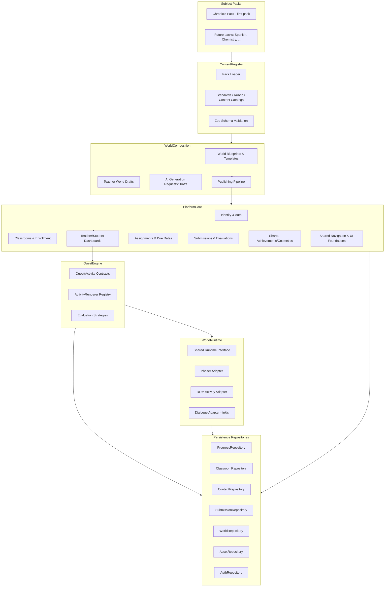
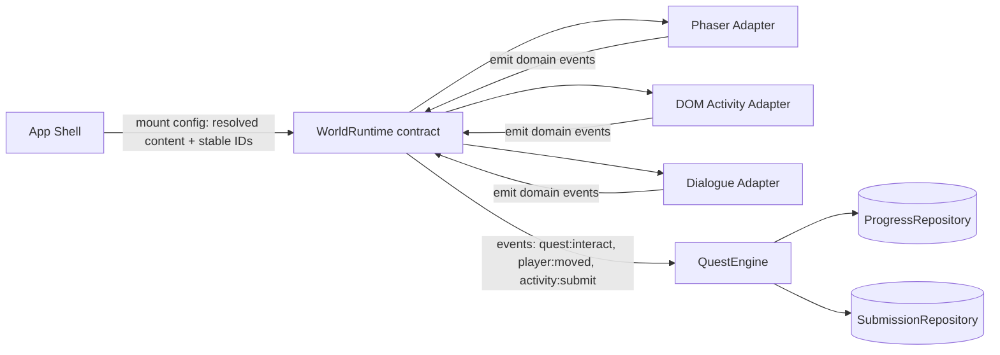

# Platform Architecture Proposal — Chronicle as the First Subject World

Status: architecture and planning only. No application code, dependencies, or file layout were changed to produce this document. Built directly on `docs/architecture/CURRENT-REPOSITORY-AUDIT.md` (what exists) and `docs/architecture/THIRD-PARTY-TOOLING-AUDIT.md` (what tools are approved or prototype-gated). Only tools that audit marked **adopt-now** (Vitest, Zod, the already-present ESLint/Prettier) or **prototype-before-adoption** (Phaser 4 + Tiled, Playwright, inkjs) appear in this architecture as load-bearing components. Everything the tooling audit put in consider-later/rejected (Storybook, Phaser Editor v5, Sentry, GitHub Actions CI, axe-core/Lighthouse CI, H5P-as-core, Yarn Spinner, Spine, LDtk, TexturePacker) appears only in the risk register or decisions-to-defer, never as something this architecture depends on.

## 1. Executive summary

Chronicle today is a single 2,927-line file with no test coverage, four incompatible content schemas, three duplicate Author Mode implementations (two dead), one orphaned full second game-loop implementation, and one undocumented AI-grading backend — all documented in the repository audit. This proposal does not discard that work. It defines seven domains — **PlatformCore** (accounts/classrooms/enrollment/assignments/submissions/publication), **ContentRegistry** (subject-pack loading, schema validation, catalogs), **WorldComposition** (blueprints, teacher drafts, AI-generation drafts, publishing pipeline), **QuestEngine** (quest/activity contracts, renderer registry, evaluation strategies), **WorldRuntime** (pluggable Phaser/DOM/dialogue runtime adapters), a **Repository layer** (Progress/Classroom/Content/Submission/World/Asset/Auth interfaces with local implementations today, remote implementations later), and **Chronicle itself, as the first Subject Pack** — and shows exactly which existing lines of `main.js` and which existing files move into which domain, in a phased, always-runnable migration.

The core design bet: a **Subject Pack is data plus declared runtime/activity requirements, never a fork of the engine.** Chronicle proves the model works by becoming the first pack under this contract rather than remaining the only thing the codebase can express. The second-subject test (§22) shows a Spanish or chemistry pack reusing 100% of PlatformCore, QuestEngine, and the persistence layer with zero Phaser dependency and zero APUSH-specific schema.

## 2. Guiding principles

1. **Enforce the engine/content boundary with folder/import structure, not just documentation intent.** The repository audit found the current "engine never contains APUSH facts" rule violated in at least three places despite being documented since decision-log `0001`. This proposal treats that as a design failure to fix structurally, not merely restate.
2. **Subject packs declare requirements; they never assume infrastructure.** A pack that needs no map runtime must not be forced to depend on Phaser, mirroring the tooling audit's explicit "Phaser must not be a universal platform runtime" conclusion.
3. **Small, reversible, always-runnable steps.** Every migration phase (§20) ends with `npm run dev` producing the same player-visible behavior as before that phase, verified manually per this project's existing workflow expectations — never a big-bang rewrite. The repository audit already shows what happens when a rewrite is abandoned mid-flight (`features/`).
4. **Wrap before you rebuild.** Existing working code (`chronicle-progress-store.js`, the field movement/collision math, `api/_lib/rubrics.js`'s rubric knowledge) gets an interface put around it first; it is not thrown away and reimplemented speculatively.
5. **Stable IDs everywhere, never display names or array position.** The audit's own risk register already flags array-index-dependent and display-name-keyed data as a live problem (`RECONSTRUCTION_LANES`, `UNIT_SOURCES`); every new model in this proposal uses explicit string IDs.
6. **Official content is immutable; teacher edits are layered, never destructive.** Detailed in §15.
7. **AI-generated content is always a draft subject to the same validation as hand-authored content.** Never a bypass.
8. **Only incorporate tools the tooling audit actually approved for this stage.** No speculative dependency additions (per that audit's own dependency-adoption policy, §18 of that document).
9. **Don't design past what's needed now.** Every domain below includes an explicit "required now" vs. "deferred" marking; the folder structure and data models include deferred fields as reserved-but-unbuilt, not as fully-implemented speculative systems.

## 3. Current-state implications

Straight from the repository audit — what this proposal must specifically account for:

- `main.js`'s ~2,927 lines mix at least five domains (routing, movement/runtime, quest state, save state, content) in one file with no internal module boundary — §20's migration plan extracts these incrementally, in dependency order, not all at once.
- The **live Unit 2 placeholder campaign** is a gift, not a problem: it's already proof that the current content shape can express more than one course, and its "structural mirror, placeholder copy" design is exactly what a Subject Pack's course-template pattern should generalize.
- The **orphaned `features/` island** (6 files, 2 dead Author Mode implementations, a 3rd incompatible schema) must be explicitly resolved (delete or archive-as-reference), not left to accumulate a 4th interpretation — see §19's renaming/reorg map.
- The **dormant JSON content pipeline** (`content/campaigns/`, `content/library/`) already anticipated several ideas this proposal needs (campaign/unit/case hierarchy, template records for sources/NPCs/locations) — its shape informs `ContentRegistry`'s schema design even though the files themselves are likely deleted, not revived as-is (decision flagged in §23).
- The **unwired `api/evaluate.js` + `api/_lib/rubrics.js`** is real, valuable prior investment — this proposal's Evaluation Strategy design (§12) formally gives it a home instead of leaving it orphaned a second time.
- **Zero tests today** means the migration plan (§20) must front-load test coverage (Phase 1) before any risky extraction (Phase 3), not after.

## 4. Tooling implications

From the tooling audit, applied concretely:

| Tool | Audit verdict | Role in this architecture |
|---|---|---|
| Zod | Adopt now | Defines every schema in `ContentRegistry` (§10), the `ProgressRepository` save shape, and activity submission schemas (§12) |
| Vitest | Adopt now | Tests pure logic extracted from `main.js` (collision math, badge logic, merge logic) as part of Phase 1/3 |
| ESLint/Prettier | Already adopted | Enforced as a migration gate (§20), existing findings fixed as part of Phase 1 |
| Phaser 4.1.x + Tiled | Prototype-before-adoption | `WorldRuntime`'s Phaser adapter (§11) and map anchor conventions (§13) are *designed* around it now, but no production code depends on it until its isolated POC (already scoped in the tooling audit, §20 of that document) succeeds |
| Playwright | Prototype-before-adoption | Required as the regression gate before Phase 3's `main.js` extraction begins (§20) |
| inkjs | Prototype-before-adoption | Dialogue content model (§12) is designed around Ink's format now; no NPC dialogue actually migrates until its standalone POC succeeds |
| Storybook, Phaser Editor v5, Sentry, GitHub Actions, axe-core/Lighthouse, H5P-as-core, Yarn Spinner, Spine, LDtk, TexturePacker | Consider-later / rejected | Not depended upon anywhere in this architecture; referenced only in §21 (risk register) and §23 (deferred decisions) |

## 5. Domain architecture



## 6. Responsibility matrix

| Domain | Owns | Does NOT own | Primary current-code source | Target location |
|---|---|---|---|---|
| PlatformCore | Accounts, roles, orgs/schools, classrooms, enrollment codes, assignments, due dates, submissions/evaluations *records* (not grading logic), notifications, analytics interfaces, publication hosting, shared achievements/cosmetics, shared nav/UI | Quest content, activity rendering, subject-specific rubrics | None today (net-new) — `chrome()` header/nav pattern in `main.js:1131` informs shared UI | `apps/web/src/platform-core/` |
| ContentRegistry | Pack loading, pack version resolution, standards/rubric/content catalogs, Zod schema validation, `npm run validate:content` | Teacher overrides, publishing, runtime rendering | `unit-01-campaign.js`/`unit-02-campaign.js` shapes (as schema source), `scripts/validate-content.js` (stub → real) | `apps/web/src/content-registry/` |
| WorldComposition | Blueprints, course/unit/quest/activity templates, teacher draft override patches, AI generation requests/drafts, dependency checking, preview, publishing/versioning | Content schema definition itself, runtime rendering, save state | `engine/content/author-content-store.js` (generic merge/path-get-set pattern), the dormant `content/campaigns` hierarchy (as design reference only), `api/evaluate.js` pattern (as generation-request precedent) | `apps/web/src/world-composition/` |
| QuestEngine | Quest/activity contracts, ActivityRenderer registry, evaluation strategies (auto/manual/hybrid), submission schemas | Runtime mounting, save persistence, content authoring | The `check-*` handlers (`main.js:2597-2765`), `UNIT_SOURCES`/`RECONSTRUCTION_LANES`/`UNIT_REVIEWS` dictionaries (as the pattern to generalize) | `apps/web/src/quest-engine/` |
| WorldRuntime | Mounting/unmounting a runtime adapter, scene lifecycle, input capture while mounted, emitting domain events | Navigation/routing, save data, quest state, content authoring | Field/hub movement, collision, camera, NPC patrol (`main.js:200-470`, `:1257-1450`, `:1500-1690`), dialogue rendering/anchoring (`fieldDialogueBubble`) | `apps/web/src/runtime/` (+ `experiments/phaser-tiled-poc/` until proven) |
| Repositories | Read/write for their noun, versioned key strategy, local implementation now | Business/validation logic | `chronicle-progress-store.js` (→ `ProgressRepository` local impl), `player-profile-store.js` (deleted, superseded) | `apps/web/src/repositories/` |
| Chronicle Pack | All APUSH-specific content: courses, units, quests, sources, NPCs, dialogue, maps, rewards, rubrics | Any platform-core, quest-engine, or runtime code | `content/unit-01-campaign.js`, `unit-02-campaign.js`, `apps/web/src/assets/*` | `apps/web/src/packs/chronicle/` |
| App Shell | Top-level screen routing, error boundaries, music/audio triggering, mounting whichever domain owns the current screen | Any domain-specific business logic | `render()` router (`main.js:2063-2181`), the Web Audio engine (`:903-1132`, kept as a PlatformCore-shared-UI-adjacent utility, not Chronicle-specific since it's mechanically generic per the repo audit's platform-core-candidates finding) | `apps/web/src/app-shell/` |

## 7. Folder structure

```
apps/web/src/
  app-shell/                       # top-level router, error boundaries, screen shell (successor to render())
    router.js
    audio-engine.js                # generalized Web Audio system (platform-core-candidate, subject-agnostic)

  platform-core/
    identity/                      # User, Role, StudentProfile, EducatorProfile (local mock now)
    organizations/                 # Organization, School
    classrooms/                    # Classroom, Enrollment, EnrollmentCode, ClassroomMembership
    dashboards/                    # teacher-dashboard.js, student-dashboard.js (shells)
    assignments/                   # Assignment, DueDate, VisibilityRule, UnlockRule
    submissions/                   # Submission record-keeping (not grading logic — see quest-engine/evaluation)
    achievements/                  # shared Badge, Cosmetic, cross-world milestone models
    ui/                            # shared chrome/nav/button/panel primitives extracted from global.css + main.js patterns

  content-registry/
    schemas/                       # Zod schemas: pack.schema.js, course.schema.js, quest.schema.js, activity.schema.js, source.schema.js, rubric.schema.js, npc.schema.js, dialogue.schema.js, map.schema.js
    catalog/                       # standards-catalog.js, rubric-catalog.js, content-catalog.js
    pack-loader.js
    validate.js                    # backs `npm run validate:content`

  world-composition/
    blueprints/                    # WorldBlueprint, CourseTemplate, UnitTemplate, QuestTemplate, ActivityTemplate
    drafts/                        # TeacherWorld, TeacherOverride (field-patch model)
    generation/                    # GenerationRequest, GeneratedDraft — wraps the api/evaluate.js structured-output pattern
    publishing/                    # ClassroomPublication, PublicationVersion, publish.js
    validation/                    # dependency checking, preview rendering hookup

  quest-engine/
    contracts/                     # Quest, Activity, QuestChain shared contracts
    activity-types/                # core neutral types: multiple-choice.js, matching.js, sequencing.js, vocabulary.js,
                                    #   source-analysis.js, short-response.js, structured-response.js (SAQ/DBQ/LEQ base),
                                    #   dialogue.js, exploration.js, collection.js, timeline.js, map-activity.js,
                                    #   debate.js, simulation.js, investigation.js, collaborative-task.js, branching-scenario.js
    renderer-registry.js           # ActivityRenderer registry
    evaluation/                    # auto.js, manual.js, hybrid.js (wraps api/_lib/rubrics.js knowledge)

  runtime/
    contracts/                     # shared runtime interface: mount/unmount/on/emit
    phaser-adapter/                # wraps Phaser.Game behind the contract (post-POC)
    dom-activity-adapter/          # non-spatial activity rendering (today's template-literal style, or React later)
    dialogue-adapter/              # inkjs-backed (post-POC)

  repositories/
    contracts/                     # interface definitions (JSDoc+Zod, no TS required)
    local/                         # local-progress-repository.js, local-classroom-repository.js, local-content-repository.js,
                                    #   local-submission-repository.js, local-world-repository.js, local-asset-repository.js,
                                    #   local-auth-repository.js  — today's real implementations
    remote/                        # empty until a backend exists; same interfaces, future implementations

  packs/
    chronicle/
      pack.manifest.js             # SubjectPack metadata: id, version, subject, gradeBands, standardsFrameworkId,
                                    #   runtimeRequirements (declares it needs the Phaser adapter), activityTypesUsed
      courses/
        unit-01/
          unit.content.js
          quests/                  # one file or folder per quest, stable-ID named
          sources/
          npcs/
          dialogue/                # .ink files, post-inkjs-POC
          rubrics/
          rewards/
        unit-02/                   # today's placeholder content, same shape
      maps/
        tiled/                     # .tmj source maps (post-Tiled-POC)
        generated/                 # exported/optimized map output, if the POC finds it necessary
      assets/                      # pack-scoped sprites/audio/documents (today's apps/web/src/assets content)

  teacher-tools/                   # the one, consolidated Author Mode / Teacher World Draft editor
  dev-tools/                       # developer-only debug panel, migration-verifier UI

  styles/                          # global.css, split later only if a real need emerges (not speculative now)

experiments/
  phaser-tiled-poc/                # isolated per tooling audit — never imported by the shipped app until proven

tests/
  unit/                            # Vitest — mirrors src/ structure
  e2e/                             # Playwright — smoke tests for the app-shell + each runtime adapter

scripts/
  validate-content.js              # real, Zod-backed

data/
  schemas/                         # generated JSON Schema exports of the Zod schemas (for non-JS tooling / future teacher-form generation)

docs/
  architecture/                    # this document and its siblings
```

This structure does not assume every subject uses maps or characters: `packs/<subject>/` only needs `maps/` and a Phaser `runtimeRequirements` declaration if that pack actually uses spatial exploration (see §22's Spanish/chemistry test, which needs neither).

## 8. Data models

Every model below states ownership, mutability, versioning, relationships, stable-ID strategy, today's (local/static) implementation, the future database home, and whether it's required now or deferred. "Now" means the model must exist (even if minimally/mocked) for Phase 1–4 of the migration (§20) to make sense; "Deferred" means the model is designed here so its *later* introduction doesn't force a breaking schema change, but no code implements it yet.

### Identity

| Model | Ownership | Mutability | Versioning | Relationships | Stable ID | Local/static now | Future DB | Required now? |
|---|---|---|---|---|---|---|---|---|
| User | PlatformCore/Identity | Mutable (profile fields) | None needed | 1:many Enrollment, 1:1 StudentProfile or EducatorProfile | UUID | Mock local record | `users` table | Deferred — mocked as a single local "player" today |
| Role | PlatformCore/Identity | Immutable enum-like | None | referenced by User | string enum (`student`,`educator`,`admin`) | Constant in code | `roles`/enum column | Deferred |
| StudentProfile | PlatformCore/Identity | Mutable | None | 1:1 User, 1:many StudentWorldProfile (per pack) | UUID | Mock local | `student_profiles` | Deferred |
| EducatorProfile | PlatformCore/Identity | Mutable | None | 1:1 User, 1:many Classroom | UUID | Mock local | `educator_profiles` | Deferred |
| Organization | PlatformCore/Organizations | Mutable | None | 1:many School | UUID | Not implemented | `organizations` | Deferred |
| School | PlatformCore/Organizations | Mutable | None | 1:many Classroom | UUID | Not implemented | `schools` | Deferred |
| Classroom | PlatformCore/Classrooms | Mutable | None (publications are versioned, not the classroom itself) | 1:many Enrollment, 1:1 current ClassroomPublication | UUID | Mock local (one default classroom) | `classrooms` | **Now** — even a single mocked classroom is needed so `TeacherWorld`/`ClassroomPublication` have somewhere to attach |
| Enrollment | PlatformCore/Classrooms | Mutable (active/dropped) | None | many:many User↔Classroom via ClassroomMembership | UUID | Mock local | `enrollments` | Deferred |
| EnrollmentCode | PlatformCore/Classrooms | Mutable (active/expired) | None | 1:1 Classroom | short human-readable code | Mock local | `enrollment_codes` | Deferred |
| ClassroomMembership | PlatformCore/Classrooms | Mutable | None | join of User+Classroom+Role | UUID | Mock local | `classroom_memberships` | Deferred |

### Content

| Model | Ownership | Mutability | Versioning | Relationships | Stable ID | Local/static now | Future DB | Required now? |
|---|---|---|---|---|---|---|---|---|
| Subject Pack | ContentRegistry | **Immutable per version** | Semver (`chronicle@1.2.0`) | 1:many Course | `<pack-slug>` | `pack.manifest.js` | `packs`/`pack_versions` | **Now** |
| Pack Version | ContentRegistry | Immutable | Semver | 1:1 Subject Pack snapshot | `<pack-slug>@<semver>` | git tag/commit today | `pack_versions` | **Now** (even if "versioning" = git history for now) |
| Course | ContentRegistry | Immutable within a pack version | Inherits pack version | 1:many Unit | `<pack-slug>/<course-id>` | `unit.content.js`-equivalent | `courses` | **Now** |
| Standards Framework | ContentRegistry | Immutable | Versioned like a pack | 1:many Standard | `<framework-id>` (e.g. `apush-ap-2025`) | Constant/catalog file | `standards_frameworks` | Deferred — Chronicle references standards only informally today |
| Standard | ContentRegistry | Immutable | Inherits framework | referenced by Quest/Activity | `<framework-id>:<code>` | Catalog file | `standards` | Deferred |
| Unit | ContentRegistry | Immutable within pack version | Inherits pack version | 1:many Quest | `<course-id>/<unit-id>` (e.g. `unit-01`) | file per unit | `units` | **Now** |
| Quest | ContentRegistry / QuestEngine contract | Immutable within pack version (teacher overrides layer on top, see §15) | Inherits pack version | 1:many Activity, prerequisiteQuestIds[] | `case-001` style, unique within pack | folder per quest | `quests` | **Now** |
| Quest Chain | QuestEngine | Immutable | Inherits pack version | ordered list of Quest IDs | `<chain-id>` | derived from `prerequisiteQuestIds` today; explicit model deferred | `quest_chains` | Deferred — today's prerequisite-array is sufficient |
| Activity | ContentRegistry / QuestEngine contract | Immutable within pack version | Inherits pack version | belongs to Quest, references RendererRegistry type | `<quest-id>/<activity-id>` | file per activity | `activities` | **Now** |
| Template | WorldComposition | Immutable (official) | Versioned like packs | referenced by WorldBlueprint | `<template-id>` | file | `templates` | Deferred (see §17) |
| Vocabulary Set | ContentRegistry (Chronicle-agnostic, pack-declared) | Immutable within pack version | Inherits pack version | referenced by Activity (vocabulary type) | `<pack>/<set-id>` | file | `vocabulary_sets` | Deferred — no vocabulary activity type exists in Chronicle today |
| Source | ContentRegistry | Immutable within pack version | Inherits pack version | referenced by Activity/Quest | `<pack>/<source-id>` | file (canonical shape resolves the audit's 4-schema conflict) | `sources` | **Now** |
| Rubric | ContentRegistry | Immutable within pack version | Inherits pack version | referenced by Activity (manual/hybrid eval) | `<pack>/<rubric-id>` | file (formalizes `api/_lib/rubrics.js`) | `rubrics` | **Now** for SAQ/DBQ/LEQ to have a home |
| Skill | ContentRegistry | Immutable | Inherits pack version | referenced by Quest (skill tags) | `<pack>/<skill-id>` | Not modeled today (no XP system exists per repo audit) | `skills` | Deferred |
| Reward | ContentRegistry | Immutable | Inherits pack version | referenced by Quest completion | `<pack>/<reward-id>` | `UNIT_BADGES`-equivalent | `rewards` | **Now** (badges already exist) |
| Item | ContentRegistry | Immutable | Inherits pack version | referenced by StudentState/Inventory | `<pack>/<item-id>` | Not modeled (no inventory exists today) | `items` | Deferred |
| Cosmetic | PlatformCore/Achievements (cross-pack) | Immutable | Inherits pack or platform version | referenced by earned rewards | `<cosmetic-id>` | Not modeled | `cosmetics` | Deferred |
| Badge | PlatformCore/Achievements | Immutable | Inherits pack or platform version | earned via Quest/Course completion | `<badge-id>` | `UNIT_BADGES` equivalent | `badges` | **Now** (Caribbean/Atlantic/Hispaniola badges already exist and are pack-scoped; a *shared* cross-pack badge is deferred) |
| NPC | ContentRegistry (Chronicle pack) | Immutable within pack version | Inherits pack version | referenced by map anchors (`npcSlot`) | `<pack>/<npc-id>` | `FIELD_NPCS` entries | `npcs` | **Now** |
| Dialogue | ContentRegistry (Chronicle pack) | Immutable within pack version | Inherits pack version | referenced by NPC | `.ink` file per NPC (post-POC) or plain string today | `dialogue_nodes` | **Now** in today's simple form; Ink-based branching deferred to post-POC |
| Map | ContentRegistry (Chronicle pack) | Immutable within pack version | Inherits pack version | contains anchors referencing Quest/NPC/Location IDs | `<pack>/<map-id>` | today's `FIELD_MAPS` entries; Tiled `.tmj` post-POC | `maps` | **Now** in today's form |
| Map Template | WorldComposition | Immutable (official) | Versioned | selectable by teachers (deferred feature) | `<template-id>` | Not modeled today | `map_templates` | Deferred |
| Asset Manifest | ContentRegistry / AssetRepository | Immutable within pack version | Inherits pack version | lists all files a pack version needs | `<pack>@<version>/manifest` | derived from `import.meta.url` usage today; explicit manifest deferred | `asset_manifests` | Deferred — today's direct `new URL()` imports are adequate until remote asset storage is needed |

### Composition

| Model | Ownership | Mutability | Versioning | Relationships | Stable ID | Local/static now | Future DB | Required now? |
|---|---|---|---|---|---|---|---|---|
| World Blueprint | WorldComposition | Mutable (draft) | Draft has no version until promoted | references Templates/Catalog entries | UUID | Not implemented | `world_blueprints` | Deferred (§17) |
| Course Template | WorldComposition | Immutable (official) | Versioned like a pack | 1:1 Course (points at a pack version) | `<template-id>` | Today, implicitly = "the pack's course itself" | `course_templates` | **Now**, minimally — today's course *is* its own template until teacher variation exists |
| Teacher World | WorldComposition | **Mutable** (this is the one deliberately-mutable content model) | Not versioned itself — publishing snapshots it (see §15) | references Course Template + list of TeacherOverride | UUID per (educator, course) | Not implemented — Author Mode today writes directly to content, which this replaces | `teacher_worlds` | **Now** — this is what Phase 6 introduces to replace the broken Author Mode |
| Teacher Override | WorldComposition | Mutable | Each override carries its own timestamp | field-path patch against a Quest/Activity/Source/etc. stable ID | `{targetId, field}` composite | Not implemented | `teacher_overrides` | **Now**, minimal field set (§15) |
| Generated Draft | WorldComposition/Generation | Mutable until accepted | Tracks originating GenerationRequest | produces TeacherOverride entries or a WorldBlueprint | UUID | Not implemented (formalizes `api/evaluate.js` pattern) | `generated_drafts` | Deferred |
| Generation Request | WorldComposition/Generation | Immutable (log) | N/A | 1:1 Generated Draft | UUID | Not implemented | `generation_requests` | Deferred |
| Content Origin | WorldComposition | Immutable metadata on every override/draft | N/A | tags TeacherOverride/GeneratedDraft as `official`\|`teacher-authored`\|`ai-generated`\|`ai-generated-then-edited` | N/A (a field, not an entity) | Not implemented | column on `teacher_overrides` | **Now**, minimal (§15's "distinguishable" requirement) |
| Classroom Publication | WorldComposition/Publishing | Mutable pointer (which version is "current") | N/A | 1:many PublicationVersion | UUID | Not implemented | `classroom_publications` | **Now**, minimal (Phase 6/7) |
| Publication Version | WorldComposition/Publishing | **Immutable** once created | Sequential integer per Classroom Publication | resolved snapshot of Course Template + TeacherOverrides at publish time | `<publication-id>/v<N>` | Not implemented | `publication_versions` | **Now**, minimal |
| Pack Dependency | ContentRegistry | Immutable | Declared per pack version | Pack → required runtime/activity-type capabilities | N/A (a manifest field) | `pack.manifest.js` field | `pack_dependencies` | **Now**, minimal |
| Runtime Dependency | ContentRegistry | Immutable | Declared per pack version | Pack → WorldRuntime adapter requirement | N/A (a manifest field) | `pack.manifest.js` field | `runtime_dependencies` | **Now**, minimal |
| Validation Result | ContentRegistry/WorldComposition | Immutable (a report) | N/A | produced per publish attempt | UUID | console/log output today | `validation_results` | **Now**, minimal (backs `npm run validate:content`) |

### Student State

| Model | Ownership | Mutability | Versioning | Relationships | Stable ID | Local/static now | Future DB | Required now? |
|---|---|---|---|---|---|---|---|---|
| Student World Profile | ProgressRepository | Mutable | None | 1:1 (Student, Pack) | `<userId>/<packId>` | Today's whole `progress` object, generalized | `student_world_profiles` | **Now** — direct generalization of `chronicle-progress-store.js` |
| Character/World Profile | ProgressRepository | Mutable | None | part of Student World Profile | same as above | `progress.profile` | column/subdoc | **Now** |
| Course Progress | ProgressRepository | Mutable | None | 1:many Unit Progress | `<userId>/<packId>/<courseId>` | `progress.completedCases` etc., generalized | `course_progress` | **Now** |
| Unit Progress | ProgressRepository | Mutable | None | 1:many Quest Progress | `<userId>/.../<unitId>` | implicit today via `completedCases`/`unlocked` | `unit_progress` | **Now** |
| Quest Progress | ProgressRepository | Mutable | None | 1:many Activity Attempt | `<userId>/.../<questId>` | `progress.caseEvidence`, `activityState` | `quest_progress` | **Now** |
| Activity Attempt | SubmissionRepository | Mutable until submitted, then immutable | Attempt number | 1:1 Submission (if submitted) | `<userId>/<activityId>/<attemptN>` | `progress.sourceActivities` | `activity_attempts` | **Now** |
| Submission | SubmissionRepository | Immutable once created | References Publication Version | 1:1 Evaluation | UUID | Not modeled distinctly today | `submissions` | **Now**, minimal |
| Evaluation | QuestEngine/Evaluation | Immutable once created (a new Evaluation is created on re-grade, not mutated) | N/A | 1:1 Submission, 0:1 RubricScore | UUID | Today's inline `check-*` boolean result | `evaluations` | **Now**, minimal |
| Rubric Score | QuestEngine/Evaluation | Immutable | N/A | 1:1 Evaluation | UUID | Not modeled (formalizes `api/_lib/rubrics.js` output) | `rubric_scores` | Deferred until SAQ/DBQ/LEQ evaluation is wired |
| Unlock State | ProgressRepository | Mutable | None | derived from Course/Unit/Quest Progress | implicit | `progress.unlocked` | `unlock_state` (or derived view) | **Now** |
| Inventory | ProgressRepository | Mutable | None | 1:many Item | `<userId>/<packId>` | Not modeled (no inventory exists today) | `inventory` | Deferred |
| Earned Reward | ProgressRepository | Mutable (append-only in practice) | None | references Reward | implicit | `progress.completedCases` implies badge-earned | `earned_rewards` | **Now**, minimal |
| Earned Badge | PlatformCore/Achievements | Mutable (append-only) | None | references Badge | implicit | Same as above, pack-scoped today | `earned_badges` | **Now**, minimal |
| Save State | ProgressRepository | Mutable | Deep-merge-on-read against defaults (proven pattern, keep it) | the whole persisted blob | `<userId>/<packId>/<courseId>` key | `chronicle-progress-store.js`'s exact mechanism, generalized | `save_states` (or the union of the above normalized tables) | **Now** |

### Teacher Operations

| Model | Ownership | Mutability | Versioning | Relationships | Stable ID | Local/static now | Future DB | Required now? |
|---|---|---|---|---|---|---|---|---|
| Assignment | PlatformCore | Mutable | None | references Quest/Unit + Classroom | UUID | Not modeled | `assignments` | Deferred |
| Due Date | PlatformCore | Mutable | None | part of Assignment or TeacherOverride | N/A (field) | Not modeled | column | Deferred, but reserved as a TeacherOverride field type now (§15) |
| Visibility Rule | PlatformCore | Mutable | None | part of Assignment or TeacherOverride | N/A (field) | Not modeled | column | Deferred, reserved now |
| Unlock Rule | QuestEngine (reads) / PlatformCore (sets) | Mutable | None | part of TeacherOverride | N/A (field) | `progress.unlocked` is student-side today; teacher-side rule is new | column | Deferred, reserved now |
| Teacher Feedback | PlatformCore/Submissions | Mutable | Append-only per Evaluation | 1:many per Evaluation | UUID | Not modeled | `teacher_feedback` | Deferred |
| Manual Grade | QuestEngine/Evaluation | Immutable once entered (re-grade = new record) | N/A | 1:1 Evaluation | UUID | Not modeled | `manual_grades` | Deferred until manual grading UI exists |
| Classroom Analytics | PlatformCore/Analytics | Derived/read-only | N/A | aggregates Submission/Progress | N/A | Not modeled | materialized view | Deferred |
| Student Analytics | PlatformCore/Analytics | Derived/read-only | N/A | aggregates one student's Progress/Submissions | N/A | Not modeled | materialized view | Deferred |
| Content Draft | WorldComposition | Mutable | Same as Teacher World | alias/specific view of Teacher World + Overrides | UUID | Not modeled | same table as `teacher_worlds` | **Now**, same model as Teacher World |
| Published Content | WorldComposition | Immutable | Same as Publication Version | alias/specific view of Publication Version | UUID | Not modeled | same table as `publication_versions` | **Now**, same model as Publication Version |

## 9. Database proposal (future — not implemented)

Grouped per the requested categories. No engine choice is made here (deferred, §23); this is a table/collection sketch only.

1. **Official content-pack data** — `packs`, `pack_versions` (immutable snapshots), `courses`, `units`, `quests`, `activities`, `sources`, `rubrics`, `standards_frameworks`, `standards`, `npcs`, `dialogue_nodes`, `maps`, `map_templates`, `asset_manifests`. Append-only per version; never updated in place once published.
2. **Teacher-owned configuration** — `teacher_worlds`, `teacher_overrides`, `generation_requests`, `generated_drafts`.
3. **Classroom publications** — `classroom_publications`, `publication_versions` (immutable snapshots), `classroom_settings`.
4. **Student progress** — `student_world_profiles`, `course_progress`, `unit_progress`, `quest_progress`, `unlock_state`, `inventory`, `earned_rewards`, `earned_badges`, `save_states`.
5. **Student submissions** — `activity_attempts`, `submissions`, `evaluations`, `rubric_scores`, `teacher_feedback`, `manual_grades`.
6. **Identity and enrollment** — `users`, `roles`, `student_profiles`, `educator_profiles`, `organizations`, `schools`, `classrooms`, `enrollments`, `enrollment_codes`, `classroom_memberships`.
7. **Shared rewards** — `badges`, `cosmetics`, `cross_world_milestones`, `account_achievements`.
8. **Analytics events** — a single append-only `analytics_events` table (`event_type`, `userId`, `packId`, `payload`, `occurredAt`), with `classroom_analytics`/`student_analytics` as derived/materialized views rather than primary storage — avoids a second source of truth for facts already in progress/submission tables.

No billing, subscription, or marketplace tables are proposed, per explicit instruction.

## 10. Subject-pack schema

```js
// pack.manifest.js (Zod-validated shape, illustrative)
{
  id: "chronicle",
  version: "1.0.0",
  subject: "us-history",
  displayName: "Chronicle",
  gradeBands: ["9-12"],
  standardsFrameworkId: "apush-ap-2025",           // optional — a pack may declare none
  courses: ["unit-01", "unit-02"],
  runtimeRequirements: {
    exploration: "phaser-adapter",                  // omit entirely if the pack has no spatial content
    dialogue: "dialogue-adapter"                     // omit if the pack has no branching dialogue
  },
  activityTypesUsed: [
    "multiple-choice", "matching", "sequencing", "source-analysis",
    "structured-response:saq", "structured-response:dbq", "structured-response:leq",
    "dialogue", "exploration", "map-activity"
  ],
  compatibility: {
    minPlatformCoreVersion: "0.1.0"
  }
}
```

`runtimeRequirements` and `activityTypesUsed` are what `WorldComposition`'s validation checks against the deployment's registered adapters/renderers before allowing publish — a pack requiring a runtime adapter that isn't registered fails validation with a clear error, rather than failing silently at render time.

## 11. Runtime architecture



- **Shared runtime interface**: every adapter implements `mount(container, config) -> handle`, `unmount(handle)`, `on(event, callback)`, `emit(event, payload)`. `config` is fully-resolved content (quest/NPC/map data with stable IDs already looked up via `ContentRegistry`) — an adapter never fetches or interprets raw pack files itself.
- **Phaser adapter**: wraps a `Phaser.Game` instance behind the contract; owns the game canvas exclusively while mounted; emits `npc:reached`, `quest:interact`, `player:moved` (for position-save, throttled — not every frame, matching the "unthrottled save is fine at today's scale but shouldn't get worse" note in the tooling audit).
- **DOM activity adapter**: renders non-spatial activities (MCQ, matching, sequencing, structured-response, etc.) using today's template-literal/DOM style as the default, with the registry designed so a future React-based renderer could register the same activity types without changing the contract.
- **Dialogue adapter**: inkjs-backed (post-POC), mountable as an overlay within either the Phaser or DOM adapter's container.
- **Navigation ownership**: stays entirely in App Shell — no runtime adapter ever changes `progress.currentScreen` or triggers a route change itself; it only emits events the App Shell listens for.
- **Save-data ownership**: exclusively `ProgressRepository`. Adapters never call `localStorage` directly (this directly closes the audit's finding of `main.js`'s ad hoc `republic-builder.audio.enabled` key bypassing the progress store).
- **Quest/progress ownership**: exclusively `QuestEngine` + `ProgressRepository`; adapters propose interactions (`quest:interact`), they never mutate quest state themselves.
- **Input ownership**: the mounted adapter owns raw input capture (keyboard/pointer) for its container; App Shell retains global shortcuts (e.g., a "return to menu" hotkey) outside the adapter's scope, and adapters must release all input listeners on `unmount` — the "no duplicate listeners on re-entry" requirement already named in the tooling-audit POC scope.
- **Scene lifecycle**: `mount`/`unmount` is the entire contract — no adapter-specific lifecycle leaks into App Shell.
- **Error boundaries**: App Shell wraps every adapter mount in try/catch with a fallback UI, generalizing `render()`'s existing try/catch-to-Institute-recovery pattern (`main.js:2070-2168`), which the repository audit found already works reasonably well.
- **Accessibility fallback**: every activity type declares a `spatialDependency: boolean`; DOM-rendered activities are the accessibility baseline. Phaser-based exploration should expose a non-spatial equivalent (e.g., a list-based objective log reachable without the canvas) — **this specific design is flagged as needing its own proof of concept (§26)**, not solved by this document.
- **Educational content stays independent of Phaser**: content always flows in as resolved `config` data from `ContentRegistry`/`QuestEngine`; it is never authored inside a Phaser scene file, matching the tooling audit's Phaser-lock-in-prevention guidance verbatim.

**Runtime questions requiring a POC before final adoption** (carried forward from the tooling audit, restated as architecture-blocking): clean mount/unmount on SPA-style route re-entry; the exact event-payload shape; whether the DOM adapter ever needs a component framework or stays vanilla; the accessibility-fallback UX above.

## 12. Activity architecture

**Common Quest contract**:
```js
{ id, packId, courseId, unitId, title, prerequisiteQuestIds: [], activityIds: [], rewardIds: [], locationRef: null, standardsRefs: [] }
```

**Common Activity contract**:
```js
{ id, questId, type, promptRef, sourceRefs: [], rubricRef: null, submissionSchema, evaluationStrategy: "auto" | "manual" | "hybrid", config }
```

**ActivityType registry** — core, subject-neutral types live in `quest-engine/activity-types/`: `multiple-choice`, `matching`, `sequencing`, `vocabulary`, `source-analysis`, `short-response`, `structured-response` (a generic multi-part, rubric-graded response — the neutral parent), `dialogue`, `exploration`, `collection`, `timeline`, `map-activity`, `debate`, `simulation`, `investigation`, `collaborative-task`, `branching-scenario`.

**APUSH-specific types are declared as Chronicle-pack extensions of `structured-response`, not baked into core**: SAQ = `structured-response` configured with `{promptParts: 3, sourceAccess: "side-by-side", rubricDimensions: [...]}`; DBQ/LEQ = the same base with different `rubricDimensions`/part counts; the "boss assessment" (`completionScreen()`'s combined MCQ+SAQ review) is a Chronicle-pack composite activity referencing several core-type activities in sequence, not a new core primitive. This directly satisfies the "do not hard-code APUSH-specific assessment types into universal core unless genuinely neutral" instruction — only the generic "structured, multi-part, rubric-graded response" shape is core; the APUSH grading rubric content lives in the Chronicle pack (`packs/chronicle/.../rubrics/`, formalizing `api/_lib/rubrics.js`).

**ActivityRenderer registry**: maps `type` (e.g. `"structured-response"`) to a render function registered by a `WorldRuntime` adapter. A pack's `activityTypesUsed` (§10) is validated at publish time against the deployment's registered renderers.

**Submission schema** (generic, Zod-validated, type-specific `payload`):
```js
{ activityId, studentId, attemptId, publicationVersionId, payload, submittedAt }
```

**Evaluation strategies**:
- `auto` — pure function against an answer key (multiple-choice, matching, sequencing) — directly generalizes today's `check-*` handlers.
- `manual` — teacher-graded, produces `ManualGrade` + `TeacherFeedback`.
- `hybrid` — an AI-assisted rubric score (formalizing `api/_lib/rubrics.js`'s HIPP/SAQ/LEQ/DBQ logic as the reference implementation) that a teacher can review/override — this is the concrete home for the currently-orphaned AI-grading backend, wired through `QuestEngine`'s evaluation module rather than called ad hoc.

## 13. Tiled architecture

Carried forward from the tooling audit's Tiled recommendation as this proposal's binding content boundary:

**Tiled owns**: terrain layers, collision boundaries, buildings/props, doors, spawn points, interactive zones, NPC anchors, quest anchors, scene transitions, map metadata.

**Tiled never owns**: quest prompts, sources, rubrics, standards, vocabulary, assessment logic, student progress, grading, teacher instructions, full dialogue content — all of this stays in `ContentRegistry`/pack content, referenced from Tiled objects only by stable ID.

**Anchor convention**: every interactive Tiled object carries exactly one of `locationId`, `questSlot`, `npcSlot`, `transitionId`, `interactionAnchor` as a custom string property — resolved against the Chronicle pack's NPC/Quest/Map content at scene-load time by the Phaser adapter, never hard-coded as a literal case-ID branch inside runtime code (the exact anti-pattern the repository audit found three times in `main.js`).

**Validation**: a Zod schema (in `content-registry/schemas/map.schema.js`) checks every anchor property is present, non-empty, and resolves against the pack's content graph — this becomes part of `WorldComposition`'s dependency-checking step, failing publish if a map references a deleted quest/NPC.

**Teacher map editing**: not supported initially (matches the tooling audit's recommendation) — teachers select from a small, curated `Map Template` catalog (§8, deferred model) rather than opening Tiled directly.

This entire section remains **design-only until the Phaser+Tiled POC succeeds** — no production map migrates to this format before that.

## 14. Teacher customization


**Initial supported override fields** (field-level patches, §15): text/prompts/instructions, sources, vocabulary, rubrics, due dates, unlock timing, visibility, rewards — implemented as `TeacherOverride { targetId, field, value, origin, updatedAt }` rows against a `TeacherWorld`.

**Designed-for-later, not built now**: quest selection, quest reordering, unit ordering, location assignment, map-template selection — the `TeacherWorld` model reserves `questOrder: []` and `selectedQuestIds: []` fields now (unused until a selection/reordering UI exists) specifically so the publish/versioning schema doesn't need a breaking change when that UI arrives.

**Explicitly not implemented initially**: teacher-written game code, fully custom mechanics, free-form map editing, teacher-created runtimes, unrestricted AI generation. Every `GeneratedDraft` (§8) is validated through the exact same `ContentRegistry` schema and `WorldComposition` dependency-checking path as hand-authored content before it can become part of a `TeacherWorld` — AI generation has no privileged bypass.

This formally replaces all **three** existing Author Mode implementations the repository audit found (`main.js`'s broken two-field panel, and the two dead ones in `features/`) with one design, consolidated in migration Phase 6.

## 15. Content inheritance

**Requirement recap**: official packs immutable; teacher customizations separate; official updates don't erase teacher edits; drafts don't affect students until published; publishing creates stable versions; submissions reference the exact version completed; generated content records origin; teacher-edited fields are distinguishable from inherited ones.

**Options compared**:

| Approach | Fit |
|---|---|
| Full content forks (copy the whole pack per teacher) | Rejected — heavy, makes upstream pack updates unmergeable, and the repository audit already shows what happens when content gets copied-and-diverged (three incompatible Case-1.01 source schemas) |
| Naive copy-on-write of the whole document per edit | Rejected — loses the "distinguishable inherited vs. edited field" requirement; a whole-document copy can't tell you which three fields out of forty a teacher actually touched |
| Patch objects only, resolved live on every read | Rejected alone — resolving overrides on every read at render time is fine for drafts/previews, but doesn't satisfy "submissions reference the exact version completed" unless something snapshots the resolved result at a point in time |
| **Field-level overrides, resolved and snapshotted at publish time (recommended)** | Combines the best of the above: overrides are small, mergeable, clearly attributable patches (`{targetId, field, value, origin}`) while in draft; at **publish**, the pack version + all current overrides are *resolved into one immutable `PublicationVersion` snapshot* — this is the copy-on-write moment, but it happens once (at publish), not on every edit |
| Layered configuration (N layers stacked at read time, no snapshot ever) | Rejected as the *only* mechanism for the same reason as pure patch-objects — needed as the *draft-preview* mechanism (layer TeacherWorld overrides over the Course Template live, for preview), but publishing still needs the snapshot step above |

**Recommended model**: **Field-level TeacherOverride patches during drafting (read via layered resolution for live preview) + a single copy-on-write snapshot into an immutable PublicationVersion at publish time.** This is the simplest approach that satisfies every stated requirement:
- Official pack immutable — never written to, ever.
- Teacher edits separate — live in `TeacherOverride` rows, not in pack files.
- Official updates don't erase edits — a pack version bump doesn't touch `teacher_overrides` at all; the next publish simply re-resolves against the new pack version (and validation would flag any override targeting a field/ID the new version removed).
- Drafts don't affect students — only `PublicationVersion` is ever read by student-facing code; `TeacherWorld`/`TeacherOverride` are draft-only.
- Publishing creates stable versions — the snapshot step, by construction.
- Submissions reference exact version — `Submission.publicationVersionId` (§8).
- Generated content records origin — `ContentOrigin` tag on every override (§8).
- Teacher-edited vs. inherited fields are distinguishable — an override only exists for fields a teacher actually touched; anything without an override row is, by definition, inherited.

## 16. Publication flow

Covered as the diagram in §14. The mechanically important detail: **`Publication Version` creation is the only place resolution + snapshotting happens.** Everything before it (drafting, preview) reads live/layered; everything after it (student play, submissions, grading) reads only the immutable snapshot. This single rule is what makes the whole inheritance model simple enough for a solo developer to implement and reason about.

## 17. World composition

`WorldComposition` is the domain that turns "an official pack" into "a specific classroom's playable version," and — later — into "a teacher's AI-assisted request for a new world." Required-now pieces: `Course Template` (today, implicitly the pack's course as-is), `Teacher World` + `Teacher Override` (Phase 6), `Classroom Publication` + `Publication Version` (Phase 6/7), and the validation/dependency-checking step that already exists in embryonic form as `scripts/validate-content.js` (Phase 1, made real). Deferred pieces: `World Blueprint`, full `Template` catalog beyond course-level, `Generation Request`/`Generated Draft` wiring to a real AI-composition UX — these are modeled now (§8) precisely so they don't require a schema break later, but no UI or generation logic is built in the phases this proposal schedules (§20).

The "five-unit Spanish world in Peru" example from the product-vision section is handled, once built, as: a `GenerationRequest` → an AI-produced `WorldBlueprint` (referencing existing `ActivityType`/`Template`/`MapTemplate` catalog entries, never inventing new runtime code) → validated by `ContentRegistry` exactly like hand-authored content → surfaced to the teacher as a `Generated Draft` they review/edit (edits become `TeacherOverride`s with `origin: "ai-generated-then-edited"`) → published through the same pipeline as any other classroom. No part of this path requires bypassing validation or generating a new codebase per teacher, satisfying the instruction's explicit constraint.

## 18. Persistence abstraction

Seven repository interfaces, each with a **local implementation now** (browser storage / static content, generalizing `chronicle-progress-store.js`'s proven pattern) and a **remote implementation later** (swapped via a small factory, never scattered calls — directly satisfying `CLAUDE.md`'s already-stated persistence design intent):

| Repository | Generalizes | Local implementation today |
|---|---|---|
| `AuthRepository` | (net-new) | Mock single-user "session" |
| `ClassroomRepository` | (net-new) | Mock single default classroom, static JSON |
| `ContentRepository` | `pack-loader.js` reading pack files | Static JS module imports (today's `import` pattern, unchanged) |
| `ProgressRepository` | `chronicle-progress-store.js` | localStorage, versioned key **per (userId, packId, courseId)** instead of one hardcoded key — same deep-merge-on-read defensive pattern, generalized |
| `SubmissionRepository` | (net-new, formalizes today's inline `check-*` results) | localStorage, keyed per attempt |
| `WorldRepository` | `engine/content/author-content-store.js`'s generic path-get/set + merge pattern (the tooling audit's strongest existing platform-core candidate) | localStorage, keyed per (educator, course) |
| `AssetRepository` | today's `new URL(..., import.meta.url)` pattern | Direct Vite static asset resolution (unchanged) |

No platform-core, quest-engine, or runtime code calls `localStorage` (or any storage API) directly under this model — every access goes through a repository, closing the audit's finding of the ungoverned `republic-builder.audio.enabled` key and the three dead, incompatible localStorage schemas in the orphaned `features/` island.

## 19. Renaming and reorganization map

| Current | Proposed | Type | Reason | Deps affected | Risk | Phase |
|---|---|---|---|---|---|---|
| `apps/web/src/main.js` (2,927 lines) | Split across `app-shell/`, `platform-core/`, `quest-engine/`, `runtime/`, `packs/chronicle/` | **Split** | Monolith mixes 5+ domains; audit's own coupling findings trace directly to this | Nothing external imports `main.js` — zero external-dependency risk, but internal risk is high given file size | High | Phases 2–4 |
| `content/unit-01-campaign.js` | `packs/chronicle/courses/unit-01/{quests,sources,npcs,rewards}/*.content.js` | **Move + Split** | Aligns with Subject Pack schema (§10) | Imported only by `main.js` | Medium | Phase 4 |
| `content/unit-02-campaign.js` | `packs/chronicle/courses/unit-02/...` (same treatment; placeholder status preserved, not hidden) | **Move + Split** | Same | Same | Medium | Phase 4 |
| `content/chronicle-case-001.js` | — | **Delete** | Confirmed dead, a 3rd incompatible schema for content already live elsewhere | None (unimported) | Low | Phase 4 |
| `apps/web/src/features/*` (6 files, orphaned island) | — (or `docs/architecture/archived-prototypes/` notes only, no code retained) | **Delete** | Confirmed unreachable; superseded by the live implementation; retaining it risks a *4th* divergent interpretation | None (unimported) | Low | Phase 6 |
| `apps/web/src/engine/content/author-content-store.js` | `world-composition/drafts/` (adapted into the `TeacherOverride` store) | **Rename + Wrap behind interface** | Genuinely generic pattern (tooling audit's strongest platform-core candidate), currently unused | Currently none; new caller in Phase 6 | Low | Phase 6 |
| `apps/web/src/engine/player/player-profile-store.js` | — | **Delete** | Duplicate of data already generalized into `Student World Profile` | None (unimported) | Low | Phase 2 |
| `apps/web/src/engine/chronicle-progress-store.js` | `repositories/local/local-progress-repository.js` | **Wrap behind interface, then extract** | Becomes the reference `ProgressRepository` implementation | Every `main.js` save/load call site | Medium | Phase 2 |
| `content/campaigns/chronicle/` + `content/library/` | — (ideas folded into `content-registry/schemas/`; files deleted, not migrated as-is) | **Delete** (design reference only, not code) | Dormant, a 4th incompatible schema, never read by the app | None | Low | Phase 4 |
| `data/schemas/case.schema.example.json` | `data/schemas/*.schema.json` (real, generated from Zod) | **Rebuild** | Currently an example instance, not a schema | `scripts/validate-content.js` will read these | Low | Phase 1 |
| `scripts/validate-content.js` | Same location | **Preserve** (implement real logic) | Right name/location already | `package.json` script unchanged | Low | Phase 1 |
| `api/evaluate.js` + `api/_lib/rubrics.js` | Logic wrapped by `quest-engine/evaluation/hybrid.js`; deployment location (`api/` vs. elsewhere) is a deferred decision (§23) | **Wrap behind interface** | Real, valuable, currently orphaned — becomes the hybrid SAQ/DBQ/LEQ evaluation strategy | Nothing currently calls it; new caller in `quest-engine` | Medium | Phase 6–7 (needs Activity architecture first) |
| root `assets/` (8 `.gitkeep`s) | — | **Delete** | Unused scaffolding contradicting where real assets actually live | `README.md`'s canonical-homes table needs a matching correction | Low | Phase 4 |
| `docs/architecture/repository-map.md`, `docs/content-guide/naming-and-placement.md`, `docs/vertical-slice/case-1-01-atlantic-crossroads.md` | Same locations, real content | **Rebuild** | Currently verbatim placeholder stubs | None | Low | Phase 1 (cheap, do early) |
| `CLAUDE.md` | Same location | **Preserve + Edit** | Stale line-count/linter/asset-location claims found by the audit | Read by every future agent session | Low | Phase 1 |

**Naming conventions**:
- **Domain folders**: kebab-case, one responsibility each (`platform-core/`, `quest-engine/`, `content-registry/`, `world-composition/`, `runtime/`, `repositories/`, `packs/`).
- **Domain concepts**: PascalCase in prose/docs and as the conceptual name (`QuestEngine`, `ContentRegistry`, `WorldRuntime`) — implemented as a set of kebab-case files within the folder, not required to be a single God-object class.
- **Repositories**: interface name `<Noun>Repository`; local implementation `local-<noun>-repository.js`; future remote implementation `remote-<noun>-repository.js`.
- **Schemas**: `<content-type>.schema.js` (Zod, source of truth) co-located with a generated `<content-type>.schema.json` (JSON Schema export) in `content-registry/schemas/` and `data/schemas/` respectively.
- **Content/packs/courses/units/quests/activities**: stable kebab-case IDs matching folder/file names 1:1 (e.g., quest `case-001` = `packs/chronicle/courses/unit-01/quests/case-001/`).
- **Maps**: Tiled source `<map-id>.tmj` under `packs/<pack>/maps/tiled/`; any generated/exported output under `.../maps/generated/` (whether that's committed or build-generated is a deferred decision, §23).
- **Phaser scenes**: `<Context>Scene` (e.g., `FieldExplorationScene`) — PascalCase file/class name, decided during the POC.
- **Tests**: mirror `src/` path under `tests/unit/` (Vitest) or `tests/e2e/` (Playwright), suffixed `.test.js` / `.spec.js`.
- **Documentation**: `docs/architecture/*.md` for cross-cutting design (this file's siblings); `docs/decision-log/NNNN-slug.md` continues unchanged — the existing duplicate-`0006`/missing-`0020` numbering gap is a housekeeping fix noted in Phase 1, not a renaming-scheme change.

## 20. Migration phases

Every phase ends with `npm run dev` producing player-visible-identical behavior (unless the phase's explicit goal is to add a new, additive screen), verified manually per this project's existing workflow expectations, plus (from Phase 1 onward) a passing `npm run lint` and Vitest/Playwright suite.

### Phase 1 — Foundations (no behavior change)
- **Goal**: give the codebase the tools to safely change itself.
- **Scope**: add Vitest; extract read-only pure functions (collision math, badge logic, save-merge logic) into separately-testable modules that `main.js` imports (no behavior change, just a `require`/`import` instead of an inline definition); add Zod schemas validating the *existing* live content shapes without changing them; make `scripts/validate-content.js` real; rebuild the 3 placeholder-stub docs; correct `CLAUDE.md`'s stale claims; fix the 1 existing lint error.
- **Files/domains affected**: new `tests/unit/`, new `content-registry/schemas/`, `scripts/validate-content.js`, `main.js` (imports only, logic unchanged), 3 doc files, `CLAUDE.md`.
- **Visible behavior**: none — purely additive/internal.
- **Dependencies**: Vitest, Zod (both adopt-now per tooling audit).
- **Risks**: low — extraction-without-behavior-change is mechanical if done function-by-function with tests written first against the *existing* inline behavior.
- **Acceptance criteria**: `npm run build` succeeds; `npm run lint` passes clean; `npm run validate:content` performs real validation and passes against current content; new Vitest suite passes; manual browser smoke-check confirms Unit 1 Case 1.01 plays identically.
- **Tests**: the new Vitest suite itself.
- **Rollback**: trivial — everything is additive; revert the commit.
- **Required now**: yes.
- **Complexity**: Low.
- **Approved tools**: Vitest, Zod, ESLint/Prettier.
- **Prototype required**: no.

### Phase 2 — Persistence abstraction (wrap, don't rewrite)
- **Goal**: introduce `ProgressRepository` as a thin interface wrapping `chronicle-progress-store.js`'s exact current behavior.
- **Scope**: `repositories/contracts/`, `repositories/local/local-progress-repository.js` (behavior-identical wrapper); `main.js`'s ~60+ `save()`/`readProgress()` call sites switch to calling the repository instead; delete the dead, duplicate `player-profile-store.js`.
- **Files/domains affected**: `engine/chronicle-progress-store.js` → `repositories/local/`, all `main.js` save/load call sites (mechanical find-replace, not logic change).
- **Visible behavior**: none.
- **Dependencies**: Phase 1's Vitest coverage should include the merge/save logic before this wrap, to catch any accidental behavior drift.
- **Risks**: medium — ~60 call sites is a lot of mechanical surface area to get exactly right in one pass; do it as a scripted find-and-replace against a fixed interface signature, not manual per-site judgment calls.
- **Acceptance criteria**: identical save/load behavior confirmed via existing Vitest merge tests + manual save/reload check in-browser.
- **Tests**: Vitest (merge logic), manual reload check.
- **Rollback**: revert commit; the wrapper is thin enough that reverting is low-risk.
- **Required now**: yes — this unlocks everything else (multi-pack save keys, `TeacherWorld`/`Submission` repositories all need this pattern established first).
- **Complexity**: Medium.
- **Approved tools**: none new.
- **Prototype required**: no.

### Phase 3 — Extract runtime-generic logic from `main.js`
- **Goal**: move movement/collision/camera/NPC-patrol logic into `runtime/` modules `main.js` imports, with zero behavior change, gated by a Playwright regression suite.
- **Scope**: `main.js:200-470`, `:1257-1450`, `:1500-1690` extracted behind the `WorldRuntime` contract's *shape* (not yet a Phaser adapter — this phase keeps today's DOM/CSS-transform rendering, just relocated and interface-shaped) into `runtime/dom-movement/` as an interim adapter.
- **Files/domains affected**: `main.js` (large internal reorganization), new `runtime/` tree.
- **Visible behavior**: none — this is the highest-risk "no visible change" phase given `main.js`'s size, hence the Playwright gate.
- **Dependencies**: **requires the Playwright POC (tooling audit) to have succeeded first** — this phase is the first real regression-test consumer.
- **Risks**: high — this is the single riskiest phase given the file's size and the decision log's documented history of regressions in exactly this code.
- **Acceptance criteria**: Playwright smoke suite (menu→field→dialogue→case-complete) passes before *and* after the extraction with identical results; manual browser check of movement/camera/dialogue/NPC patrol per `CLAUDE.md`'s own regression-prone-areas list.
- **Tests**: Playwright smoke suite (new), existing Vitest collision-math tests from Phase 1.
- **Rollback**: revert commit; Playwright suite makes "did I actually break it" answerable in CI-less local runs before committing.
- **Required now**: yes, but only after Phase 1/2 and the Playwright POC succeed.
- **Complexity**: High.
- **Approved tools**: Playwright.
- **Prototype required**: yes — Playwright POC must precede this phase.

### Phase 4 — Content model unification
- **Goal**: one canonical, Zod-validated content schema; retire the other three.
- **Scope**: migrate `unit-01-campaign.js`/`unit-02-campaign.js` into `packs/chronicle/courses/*/`, split by content type, validated by the Phase 1 Zod schemas (extended as needed); delete `content/chronicle-case-001.js` and the dormant `content/campaigns`/`content/library` tree; delete root `assets/` placeholder tree; correct `README.md`'s canonical-homes table to match.
- **Files/domains affected**: `content/*` → `packs/chronicle/*`, `content-registry/schemas/` (extended), deletions per §19.
- **Visible behavior**: none for players; Author Mode's two content-edit fields remain broken until Phase 6 (not fixed here — out of this phase's scope, avoid scope creep).
- **Dependencies**: Phase 1's schemas.
- **Risks**: medium — mechanical content move, main risk is missing a reference somewhere in `main.js`'s hard-coded `UNIT_SOURCES`/`RECONSTRUCTION_LANES`/`UNIT_REVIEWS` dictionaries during the split.
- **Acceptance criteria**: `npm run validate:content` passes against the moved content; manual playthrough of both Unit 1 and Unit 2 (placeholder) content confirms no broken references.
- **Tests**: extended Vitest content-schema tests; manual playthrough.
- **Rollback**: revert commit.
- **Required now**: yes — `WorldComposition` needs one source of truth to exist at all.
- **Complexity**: Medium.
- **Approved tools**: Zod.
- **Prototype required**: no.

### Phase 5 — Phaser + Tiled proof of concept (isolated)
- **Goal**: prove the `WorldRuntime` Phaser adapter design in `experiments/phaser-tiled-poc/`, per the scope already defined in the tooling audit — completely isolated, never touching `main.js` or `packs/chronicle/`.
- **Scope**: exactly the POC scope from the tooling audit (§20 of that document): one small Tiled map, collision, one NPC/quest anchor, save/restore position, a Playwright smoke test of the POC itself.
- **Files/domains affected**: `experiments/phaser-tiled-poc/` only.
- **Visible behavior**: none to the shipped app (not linked from it).
- **Dependencies**: Phaser 4.1.x, Tiled (desktop tool, not a dependency).
- **Risks**: contained by isolation — worst case, the POC is discarded with zero production impact.
- **Acceptance criteria**: matches the tooling audit's POC documentation requirements (`docs/experiments/PHASER-TILED-POC.md` recommendation on Phaser/Tiled adoption, migration cost estimate for one real Chronicle map).
- **Tests**: the POC's own Playwright test.
- **Rollback**: delete the `experiments/` folder; zero blast radius by design.
- **Required now**: no — deferrable relative to Phases 1–4, but must precede Phase 3's interim adapter being *replaced* by a real Phaser adapter (that replacement is explicitly out of scope for this proposal's phase list — a future decision gated on this POC's outcome).
- **Complexity**: High.
- **Approved tools**: Phaser 4.1.x, Tiled.
- **Prototype required**: this phase *is* the prototype.

### Phase 6 — Teacher Mode consolidation
- **Goal**: replace all three existing Author Mode implementations with one `TeacherWorld`/`TeacherOverride`-based editor; formally retire the `features/` island.
- **Scope**: delete `apps/web/src/features/*` (after confirming nothing salvageable beyond what's already documented in the repo audit); adapt `engine/content/author-content-store.js`'s generic merge/path logic into `world-composition/drafts/`; build the new `teacher-tools/` editor against the field-level override model (§14/§15); wire `api/evaluate.js`/`api/_lib/rubrics.js` into `quest-engine/evaluation/hybrid.js` as the SAQ/DBQ/LEQ evaluation strategy.
- **Files/domains affected**: `features/*` (deleted), `engine/content/author-content-store.js` (moved+adapted), new `world-composition/`, `teacher-tools/`, `quest-engine/evaluation/`.
- **Visible behavior**: Author Mode's two previously-broken content-edit fields become genuinely functional (a real, visible fix, not just internal reorg); a minimal Publish action exists for the first time.
- **Dependencies**: Phases 2 and 4 (repository + content-model foundations).
- **Risks**: medium-high — first phase introducing genuinely new user-facing behavior (Publish/override flow) rather than pure refactor; needs its own scoped Playwright coverage.
- **Acceptance criteria**: editing a Quest title/prompt through Teacher Mode actually persists and actually reflects in a published, student-visible version; the override is distinguishable from inherited content (§15's requirement, testable directly); a hybrid SAQ evaluation produces a rubric score via the wired-in evaluator.
- **Tests**: new Playwright coverage of the edit→preview→publish→play flow; Vitest for the override-resolution merge logic.
- **Rollback**: this phase is additive (new `teacher-tools/` UI alongside existing screens) until the old `authorPanel()` is actually removed from `main.js` — sequence the removal last, after the new UI is confirmed working, so rollback is just "don't remove the old panel yet."
- **Required now**: yes — this is what makes Teacher Customization (a named required domain) real rather than aspirational.
- **Complexity**: High.
- **Approved tools**: none new (uses Phase 1–2's Zod/repository foundations).
- **Prototype required**: no (the override-resolution model itself is fully specified in §15, no open design question remains).

### Phase 7 — PlatformCore skeleton (mocked, local-only)
- **Goal**: introduce `Identity`/`Classroom`/`Enrollment` as real (if mocked) models so Chronicle becomes "a course template inside a classroom" rather than the only thing the app can do.
- **Scope**: mock `AuthRepository`/`ClassroomRepository` (single default user, single default classroom); minimal teacher/student dashboard shells; `ClassroomPublication`/`PublicationVersion` become real (backed by Phase 6's publish action).
- **Files/domains affected**: new `platform-core/identity/`, `platform-core/classrooms/`, `platform-core/dashboards/`; `app-shell/router.js` gains a dashboard entry point above today's main-menu.
- **Visible behavior**: new, additive dashboard screens; existing Chronicle gameplay reachable through them, unchanged.
- **Dependencies**: Phase 6 (publication model must be real first).
- **Risks**: high — largest net-new surface area in this plan; mitigate by keeping identity/classroom fully mocked (no real auth) until a backend is actually chosen (§23).
- **Acceptance criteria**: a mocked "teacher" can view a dashboard, see the one published Chronicle classroom version, and a mocked "student" can enroll (via a hardcoded mock code) and play through it exactly as today.
- **Tests**: Playwright covering the new dashboard→classroom→play path.
- **Rollback**: additive; the old main-menu entry point can remain as a fallback until the dashboard path is trusted.
- **Required now**: no — deferrable until Phases 1–6 are stable and proven.
- **Complexity**: High.
- **Approved tools**: none new.
- **Prototype required**: no (the models are fully specified in §8; only the UI is new).

### Phase 8 — Deferred / future (not detailed here)
Real backend integration behind the repository interfaces; a second subject pack built for real; billing/subscriptions/marketplace — explicitly out of scope for this document per instruction, and not phased in detail here.

## 21. Risk register

| Risk | Source | Mitigation |
|---|---|---|
| Repeating the `features/` mistake — a second abandoned full rewrite | Repo audit finding | Every phase is scoped, isolable, and ends runnable; Phase 5 (Phaser) is explicitly contained in `experiments/` until proven |
| `main.js` extraction (Phase 3) breaking exactly the movement/camera/dialogue systems the decision log shows are regression-prone | Repo audit + decision log | Playwright POC required *before* Phase 3 begins, not after |
| Teacher-override model creeping into a full CMS before it's needed | This proposal's own scope | §14 explicitly lists what's deferred; Phase 6 builds only the initial field set |
| AI-generated content bypassing validation | Product-vision requirement | §17: every generated draft flows through the same `ContentRegistry` validation as hand-authored content, no exception path exists in the model |
| Publication/versioning schema under-designed before any real classroom exists | New domain, no prior art in this repo | §9's DB proposal is explicitly a sketch, not implemented; Phase 6/7 use minimal mocked versions to validate the *shape* before any real backend commitment |
| Second-subject test only discovered to fail after a second pack is actually built | Product-vision requirement | §22 does the test now, as a thought experiment, and Phase 4/6's acceptance criteria include "packs/chronicle contains zero platform-core/quest-engine code" as a directly-checkable proxy |
| Adopting consider-later/rejected tools prematurely (Storybook, Sentry, Phaser Editor, CI, H5P, Yarn Spinner, Spine, LDtk, TexturePacker) | Tooling audit | None of them appear as dependencies of any phase above; explicitly excluded per §4 |
| Phaser 4 being very new (shipped April 2026) | Tooling audit | Exact-version pin, isolated POC before commitment (both already tooling-audit policy) |
| Solo-developer bandwidth vs. scope of Phases 6–7 | Practical | Phases 6/7 marked "required now" vs. "deferrable" precisely so the minimum viable sequence (1–4, arguably 6) can ship without 7 |

## 22. Second-subject test

**Hypothetical pack**: a 5-unit conversational-Spanish world set in Peru, 8 quests per unit, per the product-vision's own example prompt. Not built — walked through against this architecture:

- `packs/spanish-peru/pack.manifest.js` declares `subject: "spanish"`, `standardsFrameworkId: "actfl-2025"` (a *different* standards framework — `ContentRegistry`'s catalog is framework-agnostic by design, §8), and `activityTypesUsed: ["vocabulary", "dialogue", "matching", "multiple-choice", "structured-response:conversational-practice"]`.
- **No Phaser dependency required**: if the pack's exploration content is light or absent, `runtimeRequirements` simply omits `exploration` — the pack ships using only the `dom-activity-adapter` and `dialogue-adapter`. Nothing in `PlatformCore`, `QuestEngine`, or the repositories cares whether a pack uses Phaser. (If the Peru setting *does* want spatial exploration, it declares `exploration: "phaser-adapter"` and gets it — the point is the architecture doesn't force the choice either way.)
- **No APUSH-specific schema required**: `structured-response:conversational-practice` is a Spanish-pack-declared extension of the same neutral `structured-response` base type Chronicle's SAQ/DBQ/LEQ extend (§12) — it defines its own rubric dimensions (pronunciation/vocabulary-use/grammar instead of HIPP/thesis/evidence), with zero changes to `quest-engine/contracts/` or `activity-types/structured-response.js`.
- **Classrooms are not rebuilt**: a Spanish teacher creates a classroom through the identical `PlatformCore/Classrooms` flow (§5) an APUSH teacher uses — `Classroom`/`Enrollment`/`EnrollmentCode` have no subject-specific fields at all.
- **Progress is not rebuilt**: `Student World Profile`/`Course Progress`/`Quest Progress` (§8) are already keyed by `(userId, packId, courseId)` — a second pack is just a second value of `packId`, not a new table or code path.
- **Teacher Mode is not rebuilt**: the Spanish teacher edits prompts/vocabulary/rubrics/due-dates through the exact same `TeacherWorld`/`TeacherOverride` model (§14/§15) — field-level overrides don't know or care what subject they belong to.
- **Publishing is not rebuilt**: `ClassroomPublication`/`PublicationVersion` (§16) resolve *any* pack version + overrides identically.
- **Submissions are not rebuilt**: `Submission`/`Evaluation`/`RubricScore` (§8) are generic; the Spanish pack supplies its own `Rubric` content, not a new evaluation code path (the `hybrid` strategy is reused, pointed at Spanish-specific rubric text instead of `api/_lib/rubrics.js`'s APUSH text).

A chemistry pack follows the identical pattern: a `simulation`-type activity (already a core neutral type, §12) extended with chemistry-specific `config` (a lab setup), no history-specific schema touched anywhere.

**This is treated as a Phase 4/6 acceptance criterion**, not just prose: after those phases, `packs/chronicle/` should contain zero imports from anything outside `content-registry`'s schema contracts — a directly `grep`-able check that domain boundaries actually held.

## 23. Decisions to defer

- TypeScript adoption (JSDoc+Zod vs. full TS) — current code is plain JS; Zod validates without requiring TS; revisit only if team/tooling needs change.
- Whether the dormant `content/campaigns`/`content/library` JSON tree is kept as an archived design reference or deleted outright (leaning delete, per §19, but not decided here as final).
- Whether generated Tiled map output is committed to the repo or produced at build time.
- Backend/database engine choice (Supabase/Firebase/custom) — the repository interfaces make this swappable later; no reason to decide before Phase 7 at the earliest.
- Whether a component framework (React or otherwise) is ever adopted for `platform-core/ui` and the DOM activity adapter, or the current vanilla-template-literal style continues.
- Exact AI-generation UX (chat-driven vs. structured form-driven world composition).
- Billing, subscriptions, marketplace — explicitly out of scope per instruction, not modeled at all.
- Where `api/evaluate.js`'s deployment target ends up (stay a Vercel-style function, move behind a different backend, etc.) — the evaluation *interface* is fixed (§12), the deployment mechanics are not.
- Whether Storybook, Phaser Editor v5, Sentry, GitHub Actions CI, or axe-core/Lighthouse CI get adopted later — explicitly deferred per the tooling audit, revisit only when their stated gating conditions are met (real components to catalog, a real Phaser scene to edit, a real deployed backend, a CI-worthy test suite, etc.).

## 24. Mermaid diagrams

This document's diagrams, indexed:
- §5 Domain architecture — overall domain relationship flowchart.
- §11 Runtime architecture — WorldRuntime adapter event flow.
- §14 Teacher customization — publication flow (Official Pack → Course Template → Teacher World Draft → Preview → Publication Version → Student Attempts).

## 25. Acceptance criteria for the completed refactor

- `npm run dev` produces identical player-visible behavior for Unit 1 Case 1.01 after every phase through Phase 4 (and additive-only new behavior in Phases 6–7).
- One canonical, Zod-validated content schema; `npm run validate:content` performs real validation and passes.
- Zero remaining orphaned/duplicate implementations — the `features/` island and the dead stores are deleted, not left to rot as a fourth interpretation.
- Every repository interface (`Progress`/`Classroom`/`Content`/`Submission`/`World`/`Asset`/`Auth`) has at least a local implementation; no platform-core/quest-engine/runtime code calls `localStorage` directly.
- `packs/chronicle/` contains zero imports from outside `content-registry`'s schema contracts (the directly-checkable second-subject-test proxy, §22).
- A Vitest suite covering pure logic and a Playwright suite covering the movement/dialogue/camera/case-complete happy path both exist and pass as the standing migration gate.
- Teacher Mode's content-edit fields are genuinely functional (fixing the audit's "broken Author Mode" finding) and produce a real, versioned `Publication`.
- The AI-grading backend (`api/_lib/rubrics.js`) is wired into a real evaluation strategy rather than sitting unreferenced.

## 26. List of assumptions requiring prototypes

- Phaser 4 mount/unmount cleanliness on SPA-style route re-entry (no duplicate input listeners) — Phase 5 POC.
- inkjs reading live, `progress`-shaped conditions for branching dialogue — standalone POC per the tooling audit, before any NPC migrates.
- Accessibility-fallback UX for spatial/Phaser-based exploration activities — explicitly unsolved in §11, needs its own design spike.
- Zod's bundle-size impact in the shipped browser bundle — expected trivial, not yet measured.
- Teacher-override preview rendering correctness/performance using the same renderer registry as production (§14) — should be validated during Phase 6, not assumed.
- The AI-generation-request → schema-valid-draft round trip actually producing usable output reliably enough for the "ask AI to draft a structured world" product-vision item — no POC scheduled for this in the phases above (Phase 8, deferred); flagged here so it isn't forgotten when that phase is eventually scoped.
